# Архитектура модуля анализа и контроля финансов FinApp

Документ предназначен для подготовки схемы «Рисунок 15 — Архитектура модуля анализа и контроля финансов FinApp» и пояснительного текста к ней. Он описывает границы модуля, состав блоков, связи между ними, направление потоков данных и подписи, которые можно перенести в графическую схему.

## 1. Назначение схемы

Схема должна показывать не всю систему FinApp, а именно уровень прикладной аналитики, реализованный модулем анализа и контроля финансов. Модуль не выполняет первичную загрузку выписок и не обучает ML-модели: он использует уже подготовленные транзакции, категории, бюджеты, цели и результаты предварительной обработки, после чего рассчитывает финансовые показатели и возвращает пользователю контрольные выводы.

Главная идея рисунка: данные проходят путь от экранов мобильного приложения к клиентскому API, затем к серверному сервису `services/analysis-control`, далее к PostgreSQL, после чего агрегированные результаты возвращаются обратно в интерфейс пользователя.

## 2. Границы модуля

### Входит в модуль

- Отображение аналитики, бюджетов, целей, уведомлений, рекомендаций и отчётов в мобильном приложении.
- Клиентский API для вызова серверных эндпоинтов анализа и контроля.
- Серверная бизнес-логика сервиса `analysis-control`.
- Расчёт финансовой сводки, cashflow, категорий расходов, торговых точек, бюджетных рисков, прогресса целей, аномалий, рекомендаций, уведомлений и отчётов.
- Чтение подготовленных данных из PostgreSQL.
- Использование `ml_category_id` и `ml_confidence` как дополнительных аналитических признаков.

### Не входит в модуль

- Первичная ML-категоризация транзакций.
- Распознавание речи и извлечение сущностей из голосового ввода.
- Импорт CSV/Excel и первичная нормализация банковских выписок.
- Обучение ML-моделей.

Эти процессы относятся к предшествующим сервисам сбора, обработки и ML. На схеме их можно показать только как внешний источник подготовленных данных, если требуется расширенный контекст.

## 3. Основные блоки для рисунка 15

На схеме удобно разместить четыре горизонтальных уровня сверху вниз.

### Уровень 1. Пользовательский интерфейс мобильного приложения

Блок: `apps/mobile`.

Внутри блока следует указать экраны:

- `AnalysisHomeScreen` — стартовый экран раздела анализа, агрегирует ключевые показатели и быстрые переходы.
- `AnalyticsScreen` — детальная аналитика по расходам, доходам, cashflow, категориям и торговым точкам.
- `BudgetsScreen` — отображение бюджетов, лимитов, текущего расхода, остатка и риска перерасхода.
- `GoalsScreen` — отображение финансовых целей, прогресса накопления, сроков и требуемых взносов.
- `NotificationsScreen` — уведомления о рисках, отклонениях, рекомендациях и событиях контроля.
- `ReportsScreen` — доступ к отчётам за выбранные периоды.

Назначение уровня: пользователь инициирует запросы и получает визуализированные результаты анализа.

### Уровень 2. Клиентский API

Блок: `apps/mobile/src/shared/api/analysis.ts`.

Внутри блока можно перечислить основные группы методов:

- `getFinancialInsights()` — получение комплексного аналитического результата за период.
- `listRecommendations()`, `generateRecommendations()`, `applyRecommendation()`, `recordRecommendationEvent()` — работа с рекомендациями и событиями их просмотра/применения.
- `listBudgets()`, `createBudget()`, `updateBudget()`, `deleteBudget()` — управление бюджетами.
- Методы работы с целями, уведомлениями и отчётами — передача запросов в соответствующие REST-эндпоинты сервиса анализа.

Назначение уровня: преобразовать действия пользователя в HTTP-запросы, добавить параметры периода или тела запросов и вернуть типизированные данные обратно в экраны.

### Уровень 3. Серверный сервис анализа и контроля

Блок: `services/analysis-control`.

Рекомендуется разбить серверный блок на три внутренних подуровня.

#### 3.1. REST-контроллеры

- `FinancialInsightController` — эндпоинт получения финансовых инсайтов за период.
- `BudgetController`, `GeneralBudgetController` — операции с бюджетами.
- `GoalController`, `GoalTransactionController` — операции с целями и пополнениями целей.
- `RecommendationController` — получение, генерация, применение и удаление рекомендаций.
- `NotificationController`, `NotificationTemplateController` — уведомления и шаблоны уведомлений.
- `ReportController`, `DashboardWidgetController` — отчёты и виджеты дашборда.

Назначение подуровня: принять запрос от клиента, определить пользователя по JWT, проверить права доступа, разобрать параметры периода и передать запрос в сервисы бизнес-логики.

#### 3.2. Прикладные сервисы

- `FinancialAnalysisFacade` — центральная точка сборки комплексного аналитического ответа.
- `BudgetService`, `GeneralBudgetService` — доменная логика бюджетов.
- `GoalService`, `GoalTransactionService` — доменная логика финансовых целей.
- `RecommendationService` — сохранённые рекомендации и события взаимодействия с ними.
- `FinancialNotificationService`, `NotificationService` — формирование и выдача уведомлений.
- `ReportService`, `DashboardWidgetService` — отчёты и дашборд-виджеты.
- `AuditLogService` — журналирование значимых операций.

Назначение подуровня: применить правила контроля, собрать данные из нескольких источников, сформировать итоговые DTO и при необходимости создать рекомендации или уведомления.

#### 3.3. Аналитические модели

- `TransactionAnalyticsModel` — расчёт финансовой сводки, daily cashflow, категорий, торговых точек и аномалий.
- `BudgetInsightModel` — расчёт использования бюджетов, остатка, процента прогресса, прогноза перерасхода и уровня риска.
- `GoalInsightModel` — расчёт прогресса целей, оставшейся суммы, требуемого ежемесячного взноса и риска невыполнения.
- `FinancialHealthScoreModel` — расчёт интегрального показателя финансового состояния.
- `RecommendationEngineModel` — генерация рекомендаций на основе сводки, бюджетов, целей, аномалий и качества данных.

Назначение подуровня: выполнить вычисления и превратить сырые данные в прикладные аналитические показатели.

### Уровень 4. Хранилище данных

Блок: `PostgreSQL`.

Внутри блока следует показать группы таблиц:

- Подготовленные данные: `transactions`, `categories`.
- Контроль расходов: `budgets`, `general_budgets`.
- Финансовые цели: `goals`, `goal_transactions`.
- Аналитические результаты и взаимодействие: `recommendations`, `recommendation_events`, `notifications`, `notification_templates`, `reports`, `dashboard_widgets`, `audit_logs`.
- Вспомогательные ML-признаки в транзакциях: `ml_category_id`, `ml_confidence`.

Назначение уровня: хранить подготовленные входные данные, пользовательские правила контроля и результаты работы прикладной аналитики.

## 4. Mermaid-схема для быстрого построения рисунка

Ниже приведён вариант схемы, который можно вставить в редактор с поддержкой Mermaid и затем экспортировать в PNG/SVG.


## 5. PlantUML-вариант для дипломной схемы

Если рисунок нужно сделать в более формальном стиле, можно использовать PlantUML.

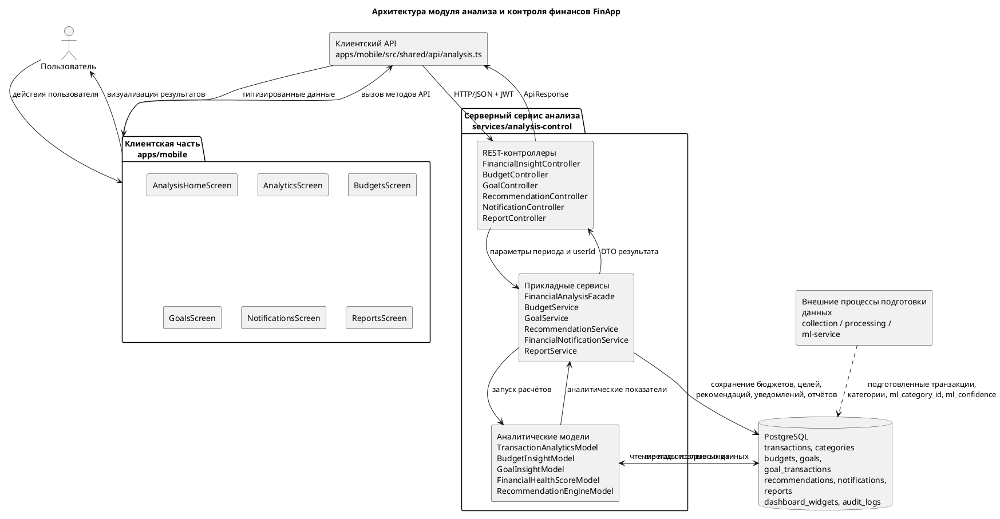

## 6. Детальный поток данных для комплексного анализа

Основной сценарий работы модуля можно описать так:

1. Пользователь открывает раздел анализа или выбирает период на экране мобильного приложения.
2. Экран вызывает метод `getFinancialInsights()` из клиентского API.
3. Клиентский API формирует HTTP-запрос `GET /api/v1/insights` и передаёт параметры `periodStart` и `periodEnd`.
4. `FinancialInsightController` принимает запрос, извлекает идентификатор пользователя из JWT и задаёт период анализа. Если период не передан, используется текущий месяц.
5. Контроллер вызывает `FinancialAnalysisFacade.analyzeUser(userId, periodStart, periodEnd)`.
6. Фасад последовательно запускает аналитические модели:
   - `TransactionAnalyticsModel.analyzeSpending()`;
   - `TransactionAnalyticsModel.analyzeDailyCashflow()`;
   - `TransactionAnalyticsModel.analyzeCategories()`;
   - `TransactionAnalyticsModel.analyzeMerchants()`;
   - `BudgetInsightModel.analyzeBudgets()`;
   - `GoalInsightModel.analyzeGoals()`;
   - `TransactionAnalyticsModel.detectAnomalies()`;
   - `FinancialHealthScoreModel.calculate()`;
   - `RecommendationEngineModel.generateRecommendations()`.
7. Модели читают данные из PostgreSQL и выполняют SQL-агрегации по транзакциям, категориям, бюджетам и целям.
8. Результаты собираются в объект `FinancialInsight`.
9. Контроллер возвращает ответ в формате `ApiResponse<FinancialInsight>`.
10. Клиентский API преобразует ответ в TypeScript-типы.
11. Экраны мобильного приложения отображают сводку, графики, бюджеты, цели, аномалии и рекомендации.

## 7. Состав итогового аналитического ответа

Комплексный ответ `FinancialInsight` можно показать на схеме как выходной поток от сервиса анализа к клиентскому API. Он включает:

- `summary` — финансовая сводка периода: доходы, расходы, чистая экономия, норма накоплений, средний дневной расход, число транзакций, регулярные расходы и качество данных.
- `healthScore` — интегральная оценка финансового состояния и факторы, повлиявшие на неё.
- `cashflow` — дневные точки движения денежных средств: доход, расход и чистый cashflow.
- `categories` — распределение расходов по категориям.
- `merchants` — крупнейшие получатели платежей или торговые точки.
- `budgets` — состояние бюджетов, остаток, процент использования, риск и прогноз перерасхода.
- `goals` — состояние финансовых целей, прогресс, оставшаяся сумма и требуемые взносы.
- `anomalies` — необычные операции или всплески расходов.
- `recommendations` — сформированные рекомендации с приоритетом, действиями и оценкой экономии.
- `metadata` — дата генерации, версия модели, источники данных и ограничения результата.

## 8. Логика аналитических моделей

### 8.1. Расчёт финансовой сводки

`TransactionAnalyticsModel` рассчитывает:

- общую сумму доходов за период;
- общую сумму расходов за период;
- чистую экономию как разницу между доходами и расходами;
- норму накоплений как отношение чистой экономии к доходам;
- средний дневной расход;
- количество транзакций;
- сумму регулярных расходов;
- показатель качества данных.

Показатель качества данных важен для объяснимости: если часть транзакций не подтверждена или имеет низкую уверенность ML-категоризации, рекомендации должны восприниматься как требующие проверки.

### 8.2. Анализ cashflow

Для cashflow транзакции агрегируются по календарным дням. Для каждого дня рассчитываются:

- сумма доходов;
- сумма расходов;
- чистый денежный поток.

На пользовательском интерфейсе эти данные можно отобразить как линейный график или столбчатую диаграмму.

### 8.3. Анализ категорий

Категориальный анализ группирует расходы по эффективной категории. Если пользовательская категория отсутствует, используется `ml_category_id`. Это позволяет учитывать результат предварительной ML-категоризации, но не переносит саму ML-категоризацию внутрь модуля анализа.

Для каждой категории рассчитываются:

- идентификатор категории;
- название категории;
- сумма расходов;
- доля от общих расходов;
- число транзакций.

### 8.4. Контроль бюджетов

`BudgetInsightModel` анализирует активные бюджеты пользователя и определяет:

- лимит бюджета;
- фактическую сумму расходов;
- остаток;
- процент использования;
- количество дней до конца периода;
- прогнозируемый расход к концу периода;
- прогнозируемый перерасход;
- уровень риска `LOW`, `MEDIUM` или `HIGH`;
- текстовое контрольное сообщение.

Логика риска может быть отражена на схеме как отдельный подпроцесс: если бюджет уже достигнут или прогнозируется перерасход, риск высокий; если использование приближается к пороговым значениям, риск средний; иначе риск низкий.

### 8.5. Контроль финансовых целей

`GoalInsightModel` рассчитывает:

- целевую сумму;
- текущую сумму;
- оставшуюся сумму;
- процент прогресса;
- количество дней до срока;
- требуемый ежемесячный взнос;
- эквивалент автосбережения;
- уровень риска невыполнения цели;
- поясняющее сообщение.

Эту часть схемы удобно связать с экраном `GoalsScreen`, потому что именно он отображает результат контроля целей.

### 8.6. Выявление отклонений

Отклонения могут быть двух типов:

- крупная транзакция, значительно превышающая средний уровень расходов;
- всплеск расходов по категории по сравнению с исторической базой.

Результат передаётся в блок рекомендаций и уведомлений, потому что серьёзные аномалии должны быть видимы пользователю.

### 8.7. Расчёт финансового здоровья

`FinancialHealthScoreModel` объединяет несколько факторов:

- положительный или отрицательный cashflow;
- норму накоплений;
- наличие бюджетов с высоким риском;
- наличие целей с высоким риском;
- наличие критичных аномалий;
- качество данных.

На выходе формируется числовой score и уровень, например `EXCELLENT`, `GOOD`, `ATTENTION` или `RISK`.

### 8.8. Генерация рекомендаций

`RecommendationEngineModel` формирует рекомендации на основании уже рассчитанного `FinancialInsight`. Рекомендация содержит:

- тип;
- заголовок;
- описание;
- список практических действий;
- оценку потенциальной экономии;
- приоритет;
- признак необходимости уведомления;
- связанную сущность, например бюджет, цель, транзакцию или категорию;
- название модели-источника.

## 9. Подписи стрелок на схеме

Для читаемости рисунка рекомендуется подписать стрелки следующим образом:

| Откуда | Куда | Подпись стрелки |
| --- | --- | --- |
| Пользователь | Экраны мобильного приложения | Действия пользователя, выбор периода, просмотр аналитики |
| Экраны | Клиентский API | Вызов методов анализа, бюджетов, целей, рекомендаций, уведомлений, отчётов |
| Клиентский API | REST-контроллеры | HTTP/JSON, JWT, параметры периода, payload операций |
| Контроллеры | Прикладные сервисы | `userId`, период анализа, параметры операции |
| Прикладные сервисы | Аналитические модели | Запуск расчётов и контроля |
| Аналитические модели | PostgreSQL | SQL-агрегации по транзакциям, категориям, бюджетам и целям |
| PostgreSQL | Аналитические модели | Подготовленные данные и справочники |
| Модели | Прикладные сервисы | Сводка, cashflow, инсайты, риски, аномалии |
| Прикладные сервисы | Контроллеры | DTO результата |
| Контроллеры | Клиентский API | `ApiResponse` с аналитическими данными |
| Клиентский API | Экраны | Типизированные данные для UI |
| Экраны | Пользователь | Графики, карточки, предупреждения, рекомендации |

## 10. Визуальные рекомендации по оформлению рисунка

Чтобы схема была понятной в дипломной работе, рекомендуется:

- Использовать четыре крупные зоны: «Клиентская часть», «Клиентский API», «Серверный сервис анализа», «База данных».
- Внутри серверного сервиса показать вложенные блоки: контроллеры, сервисы, аналитические модели.
- Стрелки основного потока сделать сплошными.
- Внешние процессы подготовки данных показать пунктирной стрелкой к PostgreSQL.
- Отдельно подписать, что `ml_category_id` и `ml_confidence` используются только как аналитические признаки.
- Возврат результата от сервера к клиенту обозначить стрелкой с подписью `FinancialInsight`, `Recommendations`, `Notifications`, `Reports`.
- Не перегружать схему всеми классами: на рисунке оставить ключевые блоки, а подробный перечень классов вынести в пояснение под рисунком.

## 11. Готовый пояснительный текст под рисунок

На рисунке 15 представлена архитектура модуля анализа и контроля финансов FinApp. Модуль построен по модульному принципу и занимает уровень прикладной аналитики: он получает подготовленные транзакционные данные, категории, бюджеты, финансовые цели и результаты предварительной обработки, после чего формирует финансовые показатели, контрольные выводы, рекомендации, уведомления и отчёты.

Клиентская часть реализована в мобильном приложении `apps/mobile` и включает экраны `AnalysisHomeScreen`, `AnalyticsScreen`, `BudgetsScreen`, `GoalsScreen`, `NotificationsScreen` и `ReportsScreen`. Эти экраны отображают пользователю финансовую сводку, динамику cashflow, состояние бюджетов и целей, выявленные отклонения, рекомендации и отчётные данные. Взаимодействие с серверной частью выполняется через клиентский API `apps/mobile/src/shared/api/analysis.ts`, который формирует HTTP-запросы к сервису анализа и возвращает в интерфейс типизированные данные.

Серверная часть модуля реализована в сервисе `services/analysis-control`. REST-контроллеры принимают запросы от мобильного клиента, извлекают идентификатор пользователя из JWT, обрабатывают параметры периода и передают управление прикладным сервисам. Центральным элементом аналитической обработки является `FinancialAnalysisFacade`, который координирует работу моделей `TransactionAnalyticsModel`, `BudgetInsightModel`, `GoalInsightModel`, `FinancialHealthScoreModel` и `RecommendationEngineModel`.

Для выполнения расчётов сервис обращается к базе данных PostgreSQL. В ней хранятся подготовленные транзакции, категории, бюджеты, цели, пополнения целей, рекомендации, уведомления, отчёты, виджеты дашборда и журналы аудита. Поля `ml_category_id` и `ml_confidence`, сохранённые на этапе предварительной обработки, используются только как дополнительные признаки при аналитической обработке. Первичная ML-категоризация выполняется вне рассматриваемого модуля и не относится к уровню прикладной аналитики.

В результате работы модуль возвращает в мобильное приложение комплексный объект финансового анализа, включающий сводку периода, cashflow, распределение расходов по категориям и торговым точкам, состояние бюджетов и целей, выявленные аномалии, оценку финансового здоровья, рекомендации и метаданные расчёта. Такая архитектура обеспечивает разделение ответственности между пользовательским интерфейсом, клиентским API, серверной бизнес-логикой и хранилищем данных, а также позволяет независимо развивать визуальное представление, API-контракты, аналитические алгоритмы и структуру хранения данных.

## 12. Краткая версия для вставки в работу

Архитектура реализованного модуля анализа и контроля финансов построена по модульному принципу и включает клиентскую часть, клиентский API, серверный сервис анализа и базу данных. Клиентская часть в `apps/mobile` отвечает за отображение результатов анализа на экранах `AnalysisHomeScreen`, `AnalyticsScreen`, `BudgetsScreen`, `GoalsScreen`, `NotificationsScreen` и `ReportsScreen`. Взаимодействие с серверной частью выполняется через клиентский API `apps/mobile/src/shared/api/analysis.ts`.

Серверный сервис `services/analysis-control` принимает запросы мобильного клиента, выполняет расчёт финансовой сводки, анализ cashflow, контроль бюджетов и целей, выявление отклонений, расчёт финансового здоровья, формирование рекомендаций, уведомлений и отчётов. Для расчётов сервис обращается к PostgreSQL, где хранятся подготовленные транзакции, категории, бюджеты, финансовые цели и результаты предварительной обработки. Сохранённые поля `ml_category_id` и `ml_confidence` используются только как дополнительные признаки при аналитической обработке; первичная ML-категоризация выполняется вне рассматриваемого модуля.

Таким образом, архитектура модуля обеспечивает разделение ответственности между пользовательским интерфейсом, клиентским API, серверной бизнес-логикой и хранилищем данных, а также демонстрирует движение данных от действий пользователя к аналитическим расчётам и обратно к визуальному представлению результатов.

## 13. Схема формирования объекта FinancialInsight

Этот раздел можно использовать для подготовки «Рисунок 16 — Схема формирования FinancialInsight». В отличие от рисунка 15, который показывает общую архитектуру модуля, рисунок 16 должен сфокусироваться на внутреннем алгоритме работы `FinancialAnalysisFacade`: какие данные фасад получает на вход, какие модели вызывает, какие промежуточные результаты формируются и как они объединяются в единый объект `FinancialInsight`.

### 13.1. Назначение рисунка 16

Схема формирования `FinancialInsight` должна показать, что фасад не выполняет все вычисления самостоятельно. Его роль — координационная. Он принимает `userId`, `periodStart` и `periodEnd`, проверяет корректность периода, вызывает специализированные аналитические модели, собирает их результаты, формирует промежуточный объект без рекомендаций, передаёт его в механизм рекомендаций и после этого возвращает финальный `FinancialInsight`.

На рисунке важно отразить две особенности:

- `FinancialHealthScoreModel` зависит не от сырых транзакций напрямую, а от уже рассчитанных результатов: `summary`, `budgets`, `goals` и `anomalies`.
- `RecommendationEngineModel` получает на вход базовый `FinancialInsight`, потому что рекомендации строятся на совокупной картине: финансовой сводке, бюджетах, целях, аномалиях, категориях и качестве данных.

### 13.2. Входные и выходные данные фасада

Вход фасада:

- `userId` — идентификатор пользователя, для которого выполняется анализ;
- `periodStart` — дата начала анализируемого периода;
- `periodEnd` — дата окончания анализируемого периода.

Внутренние источники данных:

- `transactions` — транзакции пользователя за период;
- `categories` — категории транзакций;
- `budgets` — активные бюджеты пользователя;
- `goals` и `goal_transactions` — финансовые цели и связанные с ними операции;
- `ml_category_id`, `ml_confidence` — вспомогательные признаки, сохранённые после предварительной обработки транзакций.

Выход фасада:

- `FinancialInsight` — единый объект аналитического результата, который передаётся через REST API в мобильное приложение.

### 13.3. Рекомендуемая структура рисунка 16

Для рисунка 16 удобно использовать горизонтальное расположение слева направо.

1. Слева разместить блок «Входные параметры»: `userId`, `periodStart`, `periodEnd`.
2. Далее разместить центральный блок `FinancialAnalysisFacade`.
3. Внутри или рядом с фасадом показать шаг `validatePeriod()`.
4. Справа от фасада разместить пять специализированных моделей:
   - `TransactionAnalyticsModel`;
   - `BudgetInsightModel`;
   - `GoalInsightModel`;
   - `FinancialHealthScoreModel`;
   - `RecommendationEngineModel`.
5. Ниже моделей показать PostgreSQL как источник данных для транзакций, категорий, бюджетов и целей.
6. В правой части схемы показать сборку итогового объекта `FinancialInsight`.
7. От `FinancialInsight` провести стрелку к REST API и мобильным экранам.

### 13.4. Mermaid-схема формирования FinancialInsight

Ниже приведён готовый вариант схемы для вставки в Mermaid-редактор.

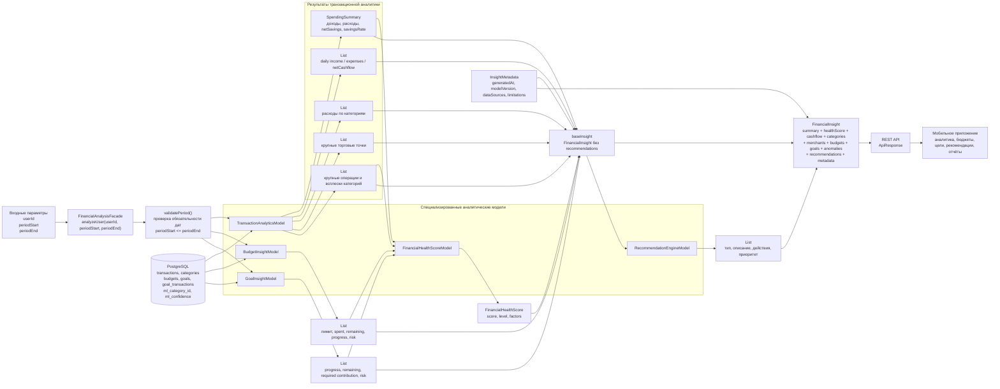

### 13.5. Упрощённая Mermaid-схема для компактного рисунка

Если на странице мало места, можно использовать компактную версию. Она лучше подходит для вставки в текстовую часть документа, где не нужно показывать все поля каждого DTO.

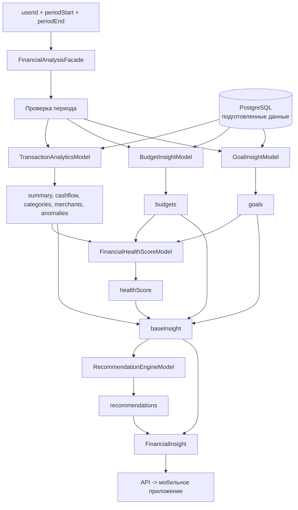

### 13.6. PlantUML-вариант рисунка 16

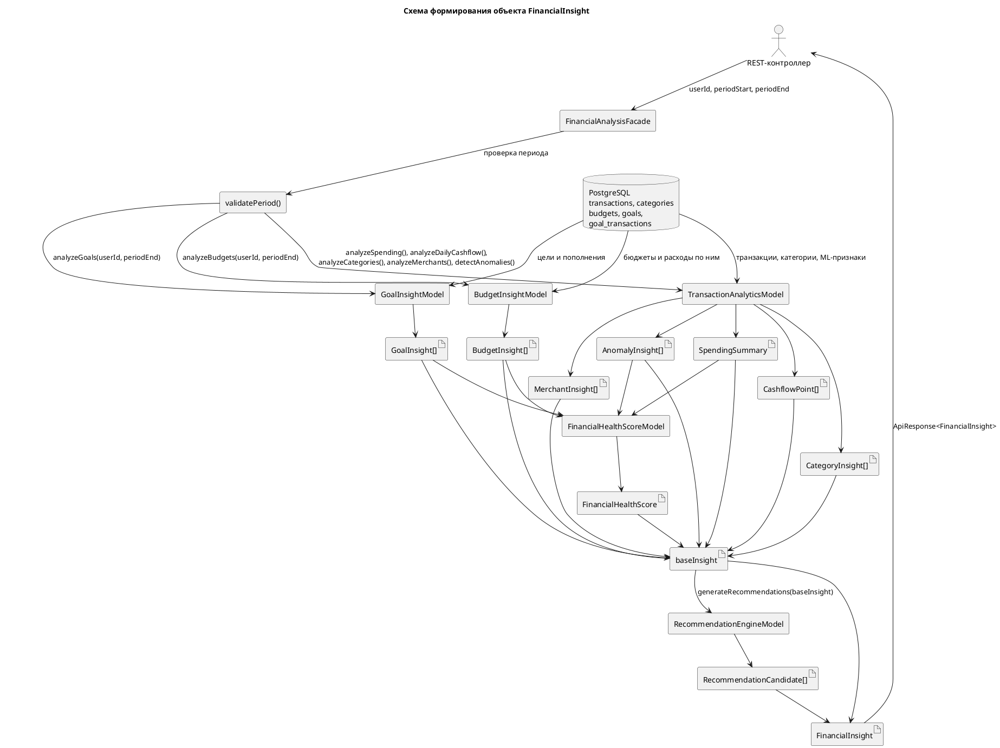

### 13.7. Последовательность формирования объекта

Алгоритм работы `FinancialAnalysisFacade` можно отразить на схеме или описать под рисунком следующим образом:

1. REST-контроллер передаёт в фасад `userId`, `periodStart` и `periodEnd`.
2. Фасад вызывает `validatePeriod()` и проверяет, что обе даты указаны, а дата начала не позже даты окончания.
3. `TransactionAnalyticsModel.analyzeSpending()` формирует `SpendingSummary`.
4. `TransactionAnalyticsModel.analyzeDailyCashflow()` формирует массив `CashflowPoint`.
5. `TransactionAnalyticsModel.analyzeCategories()` формирует список `CategoryInsight`.
6. `TransactionAnalyticsModel.analyzeMerchants()` формирует список `MerchantInsight`.
7. `BudgetInsightModel.analyzeBudgets()` формирует список `BudgetInsight` по активным бюджетам пользователя.
8. `GoalInsightModel.analyzeGoals()` формирует список `GoalInsight` по финансовым целям пользователя.
9. `TransactionAnalyticsModel.detectAnomalies()` формирует список `AnomalyInsight`.
10. `FinancialHealthScoreModel.calculate()` получает `summary`, `budgets`, `goals` и `anomalies`, после чего рассчитывает `FinancialHealthScore`.
11. Фасад собирает промежуточный `baseInsight`, где список `recommendations` временно пустой.
12. `RecommendationEngineModel.generateRecommendations(baseInsight)` анализирует базовый объект и формирует список `RecommendationCandidate`.
13. Фасад создаёт итоговый `FinancialInsight`, добавляя рекомендации и метаданные.
14. Итоговый объект возвращается в контроллер и далее передаётся через API в мобильное приложение.

### 13.8. Что показать внутри итогового объекта FinancialInsight

В правой части рисунка можно изобразить `FinancialInsight` как контейнер с такими полями:

| Поле | Источник формирования | Назначение |
| --- | --- | --- |
| `periodStart`, `periodEnd` | Входные параметры фасада | Фиксируют анализируемый период |
| `summary` | `TransactionAnalyticsModel.analyzeSpending()` | Общие доходы, расходы, экономия, норма накоплений, качество данных |
| `healthScore` | `FinancialHealthScoreModel.calculate()` | Интегральная оценка финансового состояния |
| `cashflow` | `TransactionAnalyticsModel.analyzeDailyCashflow()` | Динамика доходов и расходов по дням |
| `categories` | `TransactionAnalyticsModel.analyzeCategories()` | Распределение расходов по категориям |
| `merchants` | `TransactionAnalyticsModel.analyzeMerchants()` | Крупнейшие получатели платежей |
| `budgets` | `BudgetInsightModel.analyzeBudgets()` | Использование бюджетов и риск перерасхода |
| `goals` | `GoalInsightModel.analyzeGoals()` | Прогресс финансовых целей и риск невыполнения |
| `anomalies` | `TransactionAnalyticsModel.detectAnomalies()` | Необычные операции и всплески расходов |
| `recommendations` | `RecommendationEngineModel.generateRecommendations()` | Практические рекомендации для пользователя |
| `metadata` | `FinancialAnalysisFacade.buildMetadata()` | Дата генерации, версия модели, источники данных и ограничения |

### 13.9. Подписи стрелок для рисунка 16

| Откуда | Куда | Подпись стрелки |
| --- | --- | --- |
| REST-контроллер | `FinancialAnalysisFacade` | `userId`, `periodStart`, `periodEnd` |
| `FinancialAnalysisFacade` | `validatePeriod()` | Проверка корректности периода |
| `FinancialAnalysisFacade` | `TransactionAnalyticsModel` | Запрос транзакционной аналитики |
| `TransactionAnalyticsModel` | PostgreSQL | Чтение транзакций, категорий и ML-признаков |
| `TransactionAnalyticsModel` | `FinancialAnalysisFacade` | `summary`, `cashflow`, `categories`, `merchants`, `anomalies` |
| `FinancialAnalysisFacade` | `BudgetInsightModel` | Анализ активных бюджетов на дату `periodEnd` |
| `BudgetInsightModel` | `FinancialAnalysisFacade` | `budgets` |
| `FinancialAnalysisFacade` | `GoalInsightModel` | Анализ целей на дату `periodEnd` |
| `GoalInsightModel` | `FinancialAnalysisFacade` | `goals` |
| `FinancialAnalysisFacade` | `FinancialHealthScoreModel` | `summary`, `budgets`, `goals`, `anomalies` |
| `FinancialHealthScoreModel` | `FinancialAnalysisFacade` | `healthScore` |
| `FinancialAnalysisFacade` | `RecommendationEngineModel` | `baseInsight` |
| `RecommendationEngineModel` | `FinancialAnalysisFacade` | `recommendations` |
| `FinancialAnalysisFacade` | REST API | `FinancialInsight` |
| REST API | Мобильное приложение | `ApiResponse<FinancialInsight>` |

### 13.10. Готовый пояснительный текст под рисунок 16

На рисунке 16 представлена схема формирования объекта `FinancialInsight` центральным фасадом аналитики `FinancialAnalysisFacade`. На вход фасад получает идентификатор пользователя и период анализа, после чего выполняет проверку корректности периода и последовательно координирует работу специализированных моделей. Транзакционная аналитика формирует финансовую сводку, дневной cashflow, распределение расходов по категориям и торговым точкам, а также список выявленных отклонений. Модель бюджетов рассчитывает использование лимитов и риск перерасхода, а модель целей определяет прогресс накоплений, оставшуюся сумму и риск невыполнения цели.

После получения частных аналитических результатов фасад передаёт сводку, бюджеты, цели и аномалии в `FinancialHealthScoreModel`, где рассчитывается интегральная оценка финансового состояния пользователя. Затем фасад собирает промежуточный объект `baseInsight`, содержащий все рассчитанные показатели без рекомендаций, и передаёт его в `RecommendationEngineModel`. Это позволяет формировать рекомендации не из одного показателя, а на основе полной финансовой картины за выбранный период.

Итоговым результатом работы фасада является объект `FinancialInsight`, включающий период анализа, финансовую сводку, health score, cashflow, категории, торговые точки, бюджеты, цели, аномалии, рекомендации и метаданные расчёта. Объект возвращается через REST API в мобильное приложение и используется экранами анализа, бюджетов, целей, уведомлений, рекомендаций и отчётов. Такое построение отделяет координационную логику от частных расчётов и упрощает развитие аналитического модуля: отдельные модели можно изменять независимо, сохраняя общий контракт `FinancialInsight` для клиентского приложения.

### 13.11. Краткая версия для вставки в раздел 3.3.2

Центральным компонентом серверной части является `FinancialAnalysisFacade`. Он принимает `userId`, `periodStart` и `periodEnd`, проверяет корректность периода и координирует работу специализированных аналитических моделей. `TransactionAnalyticsModel` рассчитывает финансовую сводку, daily cashflow, распределение расходов по категориям и торговым точкам, а также выявляет аномалии. `BudgetInsightModel` анализирует активные бюджеты пользователя, `GoalInsightModel` оценивает прогресс финансовых целей, `FinancialHealthScoreModel` формирует интегральную оценку финансового состояния, а `RecommendationEngineModel` подготавливает рекомендации на основе промежуточного объекта `baseInsight`.

На рисунке 16 показано, что `FinancialInsight` формируется не одним расчётом, а последовательной сборкой нескольких групп данных: `summary`, `cashflow`, `categories`, `merchants`, `budgets`, `goals`, `anomalies`, `healthScore`, `recommendations` и `metadata`. Итоговый объект передаётся через API в мобильное приложение и используется для отображения аналитики, бюджетов, целей, уведомлений, рекомендаций и отчётов.

## 14. Схема контроля бюджета

Этот раздел можно использовать для подготовки «Рисунок 17 — Схема контроля бюджета». Рисунок должен показывать, как компонент `BudgetInsightModel` получает активные бюджеты пользователя, сопоставляет лимиты с фактическими расходами за период, рассчитывает прогноз перерасхода и формирует объект `BudgetInsight` с уровнем риска `LOW`, `MEDIUM` или `HIGH`.

### 14.1. Назначение рисунка 17

Схема контроля бюджета должна отражать не общий процесс аналитики, а отдельный механизм финансового контроля. Его задача — ответить на вопросы:

- какой лимит был задан пользователем;
- сколько уже потрачено в рамках периода бюджета;
- сколько средств осталось до лимита;
- какой процент бюджета использован;
- сохранится ли текущий темп расходов до конца периода;
- есть ли риск перерасхода;
- какое сообщение нужно показать пользователю на экране бюджетов.

На схеме важно показать, что `BudgetInsightModel` работает с уже подготовленными данными. Он не импортирует транзакции, не выполняет голосовой ввод и не запускает первичную ML-категоризацию. Если у транзакции отсутствует подтверждённая пользовательская категория, при сопоставлении с категорийным бюджетом может использоваться `ml_category_id` как вспомогательный признак.

### 14.2. Компоненты, которые нужно показать на схеме

Для рисунка 17 рекомендуется использовать следующие блоки:

1. `FinancialAnalysisFacade` или сценарий запроса аналитики — источник вызова `BudgetInsightModel.analyzeBudgets(userId, analysisDate)`.
2. `BudgetService` — получение активных бюджетов пользователя.
3. `BudgetInsightModel` — центральный блок контроля бюджета.
4. PostgreSQL — источник бюджетов, категорий и транзакций.
5. Блок фильтрации бюджетов по дате анализа.
6. Блок расчёта фактических расходов.
7. Блок расчёта показателей бюджета.
8. Блок определения риска.
9. Блок формирования `BudgetInsight`.
10. Получатели результата: `BudgetsScreen`, рекомендации, уведомления и `FinancialHealthScoreModel`.

### 14.3. Входные данные BudgetInsightModel

На вход модели поступают:

- `userId` — идентификатор пользователя;
- `analysisDate` — дата, относительно которой оценивается актуальность бюджета;
- активные бюджеты пользователя из `BudgetService.getActiveBudgets(userId)`;
- параметры каждого бюджета:
  - `budgetId`;
  - `categoryId`;
  - `amountLimit`;
  - `periodStart`;
  - `periodEnd`;
  - `period`;
  - `currency`;
  - `alertThresholds`;
  - `isActive`;
- транзакции пользователя за период бюджета;
- категории транзакций;
- вспомогательный ML-признак `ml_category_id`, если подтверждённая категория `category_id` отсутствует.

### 14.4. Логика выбора транзакций для бюджета

Для каждого активного бюджета модель определяет фактические расходы `spentAmount`.

Если бюджет общий, то есть `categoryId` отсутствует, в расчёт включаются все расходные транзакции пользователя за период бюджета:

- `user_id = userId`;
- `type = EXPENSE`;
- `date >= periodStart`;
- `date < periodEnd + 1 день`.

Если бюджет задан для конкретной категории, в расчёт включаются только расходы этой категории:

- `user_id = userId`;
- `type = EXPENSE`;
- `COALESCE(category_id, ml_category_id) = budget.categoryId`;
- `date >= periodStart`;
- `date < periodEnd + 1 день`.

Такой подход позволяет учитывать как вручную подтверждённые категории, так и результат предварительной ML-обработки, но сама ML-категоризация остаётся вне данного механизма.

### 14.5. Расчётные показатели бюджета

После получения суммы расходов модель рассчитывает основные показатели:

| Показатель | Формула / источник | Назначение |
| --- | --- | --- |
| `amountLimit` | Лимит из бюджета | Максимально допустимая сумма расходов |
| `spentAmount` | `SUM(transactions.amount)` | Фактические расходы за период бюджета |
| `remainingAmount` | `max(amountLimit - spentAmount, 0)` | Остаток до лимита |
| `progressPercent` | `spentAmount / amountLimit * 100%` | Процент использования бюджета |
| `daysRemaining` | `max(periodEnd - analysisDate, 0)` | Сколько дней осталось до конца периода |
| `elapsedDays` | `max(analysisDate - periodStart + 1, 1)` | Сколько дней периода уже прошло |
| `totalDays` | `max(periodEnd - periodStart + 1, 1)` | Полная длительность бюджетного периода |
| `forecastedSpend` | `spentAmount * totalDays / elapsedDays` | Прогноз расходов к концу периода при текущем темпе |
| `forecastedOverspend` | `max(forecastedSpend - amountLimit, 0)` | Ожидаемый перерасход |
| `riskLevel` | Правила `LOW` / `MEDIUM` / `HIGH` | Интерпретация состояния бюджета |
| `message` | Текст по уровню риска | Пояснение для пользователя |

### 14.6. Правила определения уровня риска

Для схемы можно выделить отдельный блок «Классификация риска».

Уровень `HIGH` устанавливается, если:

- `progressPercent >= 100%`, то есть лимит уже достигнут или превышен;
- или `forecastedOverspend > 0`, то есть при текущем темпе расходов прогнозируется перерасход к концу периода.

Уровень `MEDIUM` устанавливается, если:

- `progressPercent >= 85%`;
- или `progressPercent >= 70%` и до конца периода осталось больше 7 дней.

Уровень `LOW` устанавливается во всех остальных случаях, когда бюджет используется в безопасном темпе.

На рисунке это удобно представить как ромбы условий:

1. «Лимит достигнут или прогнозируется перерасход?» → `HIGH`.
2. «Использовано 85% или больше?» → `MEDIUM`.
3. «Использовано 70% или больше и осталось больше 7 дней?» → `MEDIUM`.
4. Иначе → `LOW`.

### 14.7. Формирование объекта BudgetInsight

Результатом обработки одного бюджета является объект `BudgetInsight`. На схеме его можно показать как контейнер с такими полями:

| Поле `BudgetInsight` | Смысл |
| --- | --- |
| `budgetId` | Идентификатор бюджета |
| `categoryId` | Идентификатор категории или `null` для общего бюджета |
| `categoryName` | Название категории или «Общий бюджет» |
| `periodStart`, `periodEnd` | Границы периода действия бюджета |
| `amountLimit` | Установленный лимит |
| `spentAmount` | Фактически потраченная сумма |
| `remainingAmount` | Остаток до лимита |
| `progressPercent` | Процент использования лимита |
| `riskLevel` | Уровень риска `LOW`, `MEDIUM` или `HIGH` |
| `daysRemaining` | Количество дней до конца периода |
| `forecastedOverspend` | Прогнозируемый перерасход |
| `message` | Текстовая интерпретация состояния бюджета |

После формирования всех объектов список `BudgetInsight` сортируется по уровню риска: сначала бюджеты с `HIGH`, затем `MEDIUM`, затем `LOW`. Это удобно для интерфейса, потому что наиболее проблемные бюджеты отображаются выше.

### 14.8. Mermaid-схема контроля бюджета

Ниже приведён готовый вариант схемы для вставки в Mermaid-редактор.

```mermaid
flowchart TB
    start["Запрос аналитики\nFinancialAnalysisFacade"]
    call["BudgetInsightModel\nanalyzeBudgets(userId, analysisDate)"]
    service["BudgetService\ngetActiveBudgets(userId)"]
    db[("PostgreSQL\nbudgets, categories, transactions\ncategory_id, ml_category_id")]

    active["Список активных бюджетов пользователя"]
    filter{"Бюджет актуален\nдля analysisDate?\nperiodStart <= analysisDate <= periodEnd"}
    skip["Исключить бюджет\nиз текущего анализа"]

    category{"Тип бюджета"}
    general["Общий бюджет\nсуммировать все EXPENSE\nза periodStart..periodEnd"]
    categoryBudget["Категорийный бюджет\nсуммировать EXPENSE, где\nCOALESCE(category_id, ml_category_id) = categoryId"]

    spent["spentAmount\nфактические расходы"]
    calc["Расчёт показателей\nremainingAmount = max(limit - spent, 0)\nprogressPercent = spent / limit * 100\ndaysRemaining\nelapsedDays / totalDays"]
    forecast["Прогноз\nforecastedSpend = spent * totalDays / elapsedDays\nforecastedOverspend = max(forecastedSpend - limit, 0)"]

    high{"progressPercent >= 100%\nили forecastedOverspend > 0?"}
    medium1{"progressPercent >= 85%?"}
    medium2{"progressPercent >= 70%\nи daysRemaining > 7?"}

    riskHigh["riskLevel = HIGH\nлимит достигнут или прогнозируется перерасход"]
    riskMedium["riskLevel = MEDIUM\nбюджет близок к рисковой зоне"]
    riskLow["riskLevel = LOW\nбезопасный темп расходов"]

    insight["BudgetInsight\nbudgetId, categoryName, amountLimit\nspentAmount, remainingAmount\nprogressPercent, riskLevel\ndaysRemaining, forecastedOverspend, message"]
    sort["Сортировка списка\nHIGH -> MEDIUM -> LOW"]
    output["List<BudgetInsight>"]

    consumers["Использование результата\nBudgetsScreen\nFinancialHealthScoreModel\nRecommendationEngineModel\nуведомления"]

    start --> call --> service --> active
    service --> db
    db --> service
    active --> filter
    filter -- нет --> skip
    filter -- да --> category
    category -- "categoryId = null" --> general
    category -- "categoryId задан" --> categoryBudget
    db --> general
    db --> categoryBudget
    general --> spent
    categoryBudget --> spent
    spent --> calc --> forecast --> high

    high -- да --> riskHigh
    high -- нет --> medium1
    medium1 -- да --> riskMedium
    medium1 -- нет --> medium2
    medium2 -- да --> riskMedium
    medium2 -- нет --> riskLow

    riskHigh --> insight
    riskMedium --> insight
    riskLow --> insight
    insight --> sort --> output --> consumers
```

### 14.9. Компактная Mermaid-схема для рисунка 17

Если требуется более лаконичная схема, можно использовать следующий вариант.

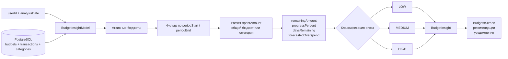

### 14.10. PlantUML-вариант схемы контроля бюджета

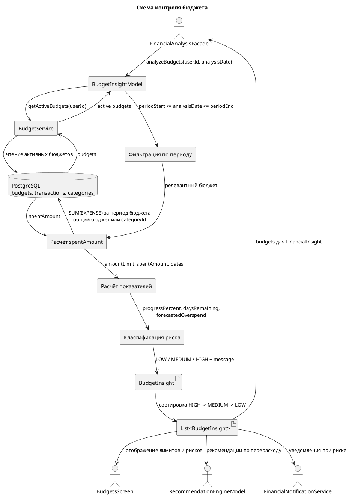

### 14.11. Последовательность контроля бюджета

Алгоритм можно описать под рисунком 17 следующим образом:

1. `FinancialAnalysisFacade` вызывает `BudgetInsightModel.analyzeBudgets(userId, analysisDate)`.
2. `BudgetInsightModel` получает активные бюджеты пользователя через `BudgetService.getActiveBudgets(userId)`.
3. Для каждого бюджета выполняется проверка актуальности: `periodStart <= analysisDate <= periodEnd`.
4. Если бюджет не относится к текущей дате анализа, он исключается из расчёта.
5. Если бюджет общий, модель суммирует все расходные транзакции пользователя за период бюджета.
6. Если бюджет категорийный, модель суммирует расходные транзакции, у которых `category_id` или `ml_category_id` соответствует категории бюджета.
7. На основе лимита и фактических расходов рассчитываются `remainingAmount` и `progressPercent`.
8. На основе дат периода рассчитываются `daysRemaining`, `elapsedDays` и `totalDays`.
9. По текущему темпу расходов рассчитывается `forecastedSpend` и `forecastedOverspend`.
10. Модель определяет уровень риска: `HIGH`, `MEDIUM` или `LOW`.
11. Для бюджета формируется текстовое сообщение, объясняющее состояние лимита.
12. Модель создаёт объект `BudgetInsight`.
13. Все `BudgetInsight` сортируются по риску, чтобы наиболее проблемные бюджеты отображались первыми.
14. Список передаётся в `FinancialInsight`, на экран `BudgetsScreen`, а также используется при формировании рекомендаций, уведомлений и общей оценки финансового состояния.

### 14.12. Подписи стрелок для рисунка 17

| Откуда | Куда | Подпись стрелки |
| --- | --- | --- |
| `FinancialAnalysisFacade` | `BudgetInsightModel` | `analyzeBudgets(userId, analysisDate)` |
| `BudgetInsightModel` | `BudgetService` | Запрос активных бюджетов пользователя |
| `BudgetService` | PostgreSQL | Чтение `budgets` |
| PostgreSQL | `BudgetInsightModel` | Бюджеты, категории, расходные транзакции |
| `BudgetInsightModel` | Фильтр периода | Проверка актуальности бюджета |
| Фильтр периода | Расчёт расходов | Только бюджеты, действующие на `analysisDate` |
| Расчёт расходов | PostgreSQL | `SUM(amount)` по `EXPENSE` за период бюджета |
| Расчёт расходов | Расчёт показателей | `spentAmount` |
| Расчёт показателей | Классификация риска | `progressPercent`, `forecastedOverspend`, `daysRemaining` |
| Классификация риска | `BudgetInsight` | `LOW` / `MEDIUM` / `HIGH`, `message` |
| `BudgetInsight` | `BudgetsScreen` | Отображение лимита, остатка, прогресса и риска |
| `BudgetInsight` | `RecommendationEngineModel` | Основание для рекомендаций по снижению расходов |
| `BudgetInsight` | `FinancialNotificationService` | Основание для уведомлений о риске перерасхода |
| `BudgetInsight` | `FinancialHealthScoreModel` | Учет бюджетного риска в общей оценке состояния |

### 14.13. Готовый пояснительный текст под рисунок 17

На рисунке 17 представлена схема контроля бюджета в модуле анализа и контроля финансов. Центральным компонентом данного механизма является `BudgetInsightModel`, который получает активные бюджеты пользователя, проверяет их актуальность для даты анализа и сопоставляет установленные лимиты с фактическими расходами за период действия бюджета. Источником данных выступает PostgreSQL, где хранятся бюджеты, категории и подготовленные транзакции пользователя. Первичный ввод, импорт, голосовой ввод и первичная ML-категоризация в рамках данного механизма не выполняются.

Для общего бюджета модель суммирует все расходные транзакции пользователя за период. Для категорийного бюджета учитываются только транзакции соответствующей категории; при отсутствии подтверждённой пользовательской категории может использоваться `ml_category_id`, сохранённый на этапе предварительной обработки. После расчёта фактических расходов модель определяет остаток до лимита, процент использования бюджета, количество дней до конца периода, прогноз расходов при текущем темпе и возможный перерасход.

На основании рассчитанных показателей `BudgetInsightModel` присваивает бюджету уровень риска. Уровень `HIGH` используется, если лимит уже достигнут или при текущем темпе прогнозируется перерасход. Уровень `MEDIUM` применяется, если бюджет близок к исчерпанию или значительная часть лимита израсходована задолго до конца периода. Уровень `LOW` означает, что бюджет используется в безопасном темпе. Итогом работы модели является объект `BudgetInsight`, содержащий лимит, потраченную сумму, остаток, процент использования, прогнозируемый перерасход, уровень риска и поясняющее сообщение.

Результат контроля бюджета используется для отображения состояния лимитов на `BudgetsScreen`, входит в состав объекта `FinancialInsight`, учитывается при расчёте общей оценки финансового состояния пользователя и может служить основанием для формирования рекомендаций и уведомлений. При наличии данных общего бюджета они могут применяться как дополнительный источник для общей бюджетной аналитики.

### 14.14. Краткая версия для вставки в раздел 3.4.1

Контроль бюджетов реализован компонентом `BudgetInsightModel`. Он получает активные бюджеты пользователя, проверяет их применимость к дате анализа и сопоставляет заданные лимиты с фактическими расходами за соответствующий период. Для общего бюджета учитываются все расходные транзакции пользователя, а для категорийного бюджета — только транзакции соответствующей категории, определяемой по `category_id` или, при его отсутствии, по `ml_category_id`.

На основе лимита и расходов рассчитываются `spentAmount`, `remainingAmount`, `progressPercent`, `daysRemaining`, `forecastedOverspend` и уровень риска `LOW`, `MEDIUM` или `HIGH`. Сформированный объект `BudgetInsight` используется на экране `BudgetsScreen`, включается в `FinancialInsight`, а также применяется при генерации рекомендаций, уведомлений и общей оценки финансового состояния пользователя.

## 15. Схема контроля финансовой цели

Этот раздел можно использовать для подготовки «Рисунок 18 — Схема контроля финансовой цели». Рисунок должен показывать, как компонент `GoalInsightModel` анализирует активные финансовые цели пользователя, сопоставляет целевую сумму с текущей накопленной суммой, учитывает срок достижения цели, рассчитывает требуемый регулярный взнос и формирует объект `GoalInsight` с уровнем риска `LOW`, `MEDIUM` или `HIGH`.

### 15.1. Назначение рисунка 18

Схема контроля финансовой цели должна отражать отдельный механизм финансового контроля, который отвечает за оценку достижимости цели в установленный срок. В отличие от контроля бюджета, где анализируется риск перерасхода лимита, контроль цели оценивает риск недостижения целевой суммы к дедлайну.

Схема должна помочь понять:

- какая цель анализируется;
- какая сумма уже накоплена;
- сколько осталось накопить до целевой суммы;
- сколько дней осталось до дедлайна;
- какой ежемесячный взнос нужен для достижения цели;
- достаточен ли текущий автоплатёж или автосбережение;
- какой уровень риска нужно присвоить цели;
- какое сообщение нужно показать пользователю на `GoalsScreen`.

### 15.2. Компоненты, которые нужно показать на схеме

Для рисунка 18 рекомендуется использовать следующие блоки:

1. `FinancialAnalysisFacade` или сценарий запроса аналитики — источник вызова `GoalInsightModel.analyzeGoals(userId, analysisDate)`.
2. `GoalService` — получение активных финансовых целей пользователя.
3. `GoalInsightModel` — центральный блок контроля целей.
4. PostgreSQL — источник целей и связанных операций пополнения.
5. Блок получения параметров цели.
6. Блок расчёта прогресса и остатка.
7. Блок расчёта срока до дедлайна.
8. Блок расчёта требуемого ежемесячного взноса.
9. Блок пересчёта автосбережения в месячный эквивалент.
10. Блок классификации риска.
11. Блок формирования `GoalInsight`.
12. Получатели результата: `GoalsScreen`, `RecommendationEngineModel`, `FinancialNotificationService` и `FinancialHealthScoreModel`.

### 15.3. Входные данные GoalInsightModel

На вход модели поступают:

- `userId` — идентификатор пользователя;
- `analysisDate` — дата, относительно которой оценивается состояние цели;
- активные цели пользователя из `GoalService.getActiveGoals(userId)`;
- параметры каждой цели:
  - `goalId`;
  - `name`;
  - `status`;
  - `priority`;
  - `targetAmount`;
  - `currentAmount`;
  - `deadline`;
  - `goalType`;
  - `autoSaveAmount`;
  - `autoSaveFrequency`;
  - `currency`;
  - `icon` и `color` для отображения в интерфейсе;
- связанные операции пополнения цели из `goal_transactions`, если они используются для обновления накопленной суммы.

В текущей логике контроля ключевыми числовыми параметрами являются `targetAmount`, `currentAmount`, `deadline`, `autoSaveAmount` и `autoSaveFrequency`. Они позволяют оценить, насколько цель близка к выполнению и достаточно ли текущего регулярного пополнения.

### 15.4. Расчётные показатели финансовой цели

После получения активной цели модель рассчитывает показатели, которые затем отображаются пользователю и используются в других аналитических механизмах.

| Показатель | Формула / источник | Назначение |
| --- | --- | --- |
| `targetAmount` | Целевая сумма из цели | Сумма, которую пользователь планирует накопить |
| `currentAmount` | Текущая накопленная сумма | Сколько уже накоплено |
| `remainingAmount` | `max(targetAmount - currentAmount, 0)` | Сколько осталось накопить |
| `progressPercent` | `currentAmount / targetAmount * 100%` | Процент выполнения цели |
| `daysRemaining` | `max(deadline - analysisDate, 0)` | Сколько дней осталось до дедлайна |
| `monthsRemaining` | `max(ceil(daysRemaining / 30), 1)` | Условное количество месяцев до дедлайна |
| `requiredMonthlyContribution` | `remainingAmount / monthsRemaining` | Какой ежемесячный взнос нужен для достижения цели |
| `monthlyAutoSaveEquivalent` | Пересчёт автосбережения в месяц | Сколько пользователь уже планирует откладывать ежемесячно |
| `riskLevel` | Правила `LOW` / `MEDIUM` / `HIGH` | Риск невыполнения цели |
| `message` | Текст по уровню риска | Пояснение для пользователя |

### 15.5. Пересчёт автосбережения в месячный эквивалент

Если для цели настроено автосбережение, модель приводит его к месячному эквиваленту. Это нужно, чтобы сравнить текущую регулярную стратегию накопления с требуемым ежемесячным взносом.

Правила пересчёта:

| Частота автосбережения | Расчёт месячного эквивалента |
| --- | --- |
| `DAILY` | `autoSaveAmount * 30` |
| `WEEKLY` | `autoSaveAmount * 4` |
| `MONTHLY` или значение по умолчанию | `autoSaveAmount` |
| `YEARLY` | `autoSaveAmount / 12` |
| Не задано или сумма равна нулю | `0` |

Например, если пользователь откладывает 500 рублей в неделю, месячный эквивалент будет равен примерно 2000 рублей. Если требуемый ежемесячный взнос выше этого значения, цель может перейти в зону `MEDIUM` или `HIGH` в зависимости от оставшегося срока.

### 15.6. Правила определения уровня риска цели

Для рисунка 18 рекомендуется выделить отдельный блок «Классификация риска невыполнения цели».

Уровень `LOW` устанавливается, если:

- `progressPercent >= 100%`, то есть цель уже достигнута;
- или `monthlyAutoSaveEquivalent >= requiredMonthlyContribution`, то есть текущий регулярный взнос достаточен для достижения цели в срок.

Уровень `HIGH` устанавливается, если:

- цель ещё не достигнута, но `daysRemaining <= 0`, то есть дедлайн наступил или прошёл;
- или `monthlyAutoSaveEquivalent < requiredMonthlyContribution` и до дедлайна осталось `45` дней или меньше.

Уровень `MEDIUM` устанавливается, если:

- цель ещё не достигнута;
- дедлайн ещё не наступил;
- текущий месячный эквивалент автосбережения меньше требуемого ежемесячного взноса;
- при этом до дедлайна осталось больше `45` дней.

На рисунке это удобно представить как последовательность условий:

1. «Цель достигнута?» → `LOW`.
2. «Дедлайн наступил или прошёл?» → `HIGH`.
3. «Автосбережение меньше требуемого взноса?» → если да, проверить срок.
4. «До дедлайна 45 дней или меньше?» → `HIGH`.
5. «До дедлайна больше 45 дней?» → `MEDIUM`.
6. «Автосбережение достаточно?» → `LOW`.

### 15.7. Формирование объекта GoalInsight

Результатом обработки одной цели является объект `GoalInsight`. На схеме его можно показать как контейнер с такими полями:

| Поле `GoalInsight` | Смысл |
| --- | --- |
| `goalId` | Идентификатор финансовой цели |
| `name` | Название цели |
| `status` | Текущий статус цели |
| `priority` | Приоритет цели, если задан пользователем |
| `deadline` | Плановая дата достижения цели |
| `targetAmount` | Целевая сумма |
| `currentAmount` | Уже накопленная сумма |
| `remainingAmount` | Остаток до целевой суммы |
| `progressPercent` | Процент выполнения цели |
| `riskLevel` | Уровень риска `LOW`, `MEDIUM` или `HIGH` |
| `daysRemaining` | Количество дней до дедлайна |
| `requiredMonthlyContribution` | Требуемый ежемесячный взнос |
| `monthlyAutoSaveEquivalent` | Текущий автоплатёж, пересчитанный в месяц |
| `message` | Текстовая интерпретация состояния цели |

После формирования всех объектов список `GoalInsight` сортируется по уровню риска: сначала цели с `HIGH`, затем `MEDIUM`, затем `LOW`. Благодаря этому пользователь видит в интерфейсе наиболее проблемные цели первыми.

### 15.8. Mermaid-схема контроля финансовой цели

Ниже приведён готовый вариант схемы для вставки в Mermaid-редактор.

```mermaid
flowchart TB
    start["Запрос аналитики\nFinancialAnalysisFacade"]
    call["GoalInsightModel\nanalyzeGoals(userId, analysisDate)"]
    service["GoalService\ngetActiveGoals(userId)"]
    db[("PostgreSQL\ngoals, goal_transactions")]

    active["Список активных финансовых целей"]
    params["Параметры цели\ntargetAmount, currentAmount\ndeadline, priority\nautoSaveAmount, autoSaveFrequency"]

    progress["Расчёт прогресса\nremainingAmount = max(target - current, 0)\nprogressPercent = current / target * 100"]
    dates["Расчёт срока\ndaysRemaining = max(deadline - analysisDate, 0)\nmonthsRemaining = max(ceil(daysRemaining / 30), 1)"]
    required["Требуемый взнос\nrequiredMonthlyContribution = remainingAmount / monthsRemaining"]
    autosave["Месячный эквивалент автосбережения\nDAILY * 30\nWEEKLY * 4\nMONTHLY\nYEARLY / 12"]

    reached{"progressPercent >= 100%?"}
    overdue{"daysRemaining <= 0?"}
    enough{"monthlyAutoSaveEquivalent >=\nrequiredMonthlyContribution?"}
    urgent{"daysRemaining <= 45?"}

    low["riskLevel = LOW\nцель достигнута или темп достаточный"]
    medium["riskLevel = MEDIUM\nнужно увеличить регулярный взнос"]
    high["riskLevel = HIGH\nдедлайн близко или уже прошёл"]

    insight["GoalInsight\ngoalId, name, status, priority\ndeadline, targetAmount, currentAmount\nremainingAmount, progressPercent\nriskLevel, daysRemaining\nrequiredMonthlyContribution\nmonthlyAutoSaveEquivalent, message"]
    sort["Сортировка списка\nHIGH -> MEDIUM -> LOW"]
    output["List<GoalInsight>"]

    consumers["Использование результата\nGoalsScreen\nFinancialHealthScoreModel\nRecommendationEngineModel\nуведомления"]

    start --> call --> service --> active
    service --> db
    db --> service
    active --> params
    db -. "операции пополнения\nпри обновлении currentAmount" .-> params

    params --> progress --> dates --> required --> autosave --> reached
    reached -- да --> low
    reached -- нет --> overdue
    overdue -- да --> high
    overdue -- нет --> enough
    enough -- да --> low
    enough -- нет --> urgent
    urgent -- да --> high
    urgent -- нет --> medium

    low --> insight
    medium --> insight
    high --> insight
    insight --> sort --> output --> consumers
```

### 15.9. Компактная Mermaid-схема для рисунка 18

Если нужна более простая схема для вставки в документ, можно использовать компактный вариант.

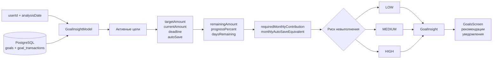

### 15.10. PlantUML-вариант схемы контроля финансовой цели

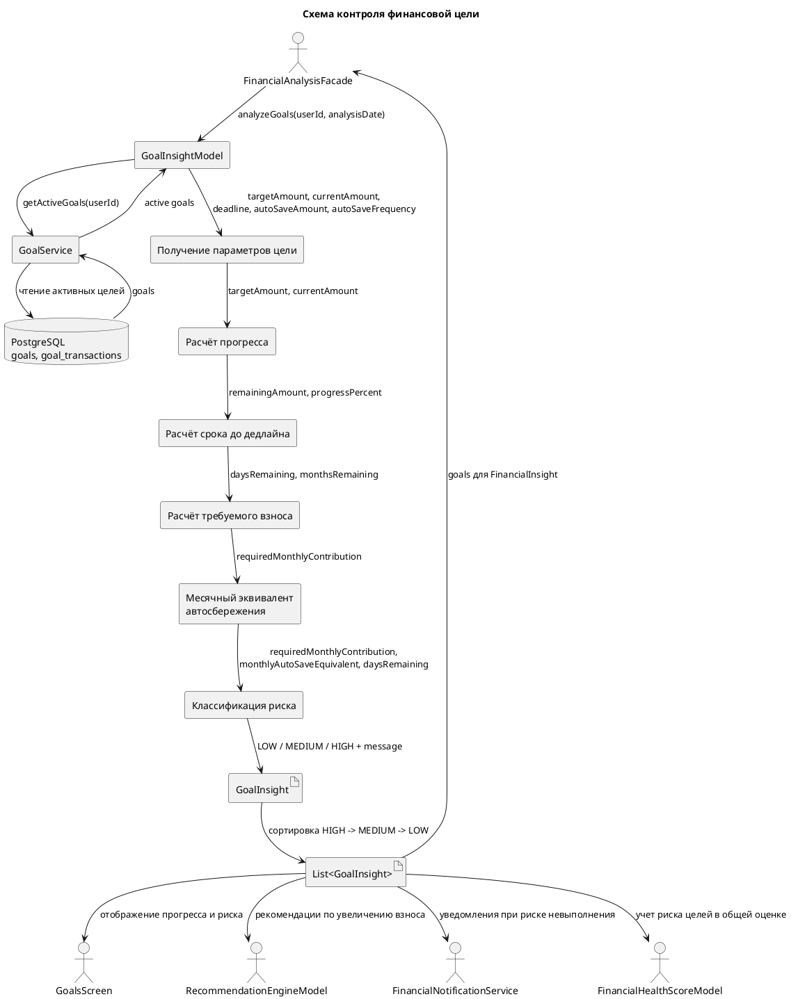

### 15.11. Последовательность контроля финансовой цели

Алгоритм можно описать под рисунком 18 следующим образом:

1. `FinancialAnalysisFacade` вызывает `GoalInsightModel.analyzeGoals(userId, analysisDate)`.
2. `GoalInsightModel` получает активные цели пользователя через `GoalService.getActiveGoals(userId)`.
3. Для каждой цели извлекаются `targetAmount`, `currentAmount`, `deadline`, `autoSaveAmount`, `autoSaveFrequency`, `status` и `priority`.
4. Модель рассчитывает `remainingAmount` как остаток между целевой и текущей суммой.
5. Модель рассчитывает `progressPercent` как долю текущей суммы от целевой.
6. На основе `analysisDate` и `deadline` определяется `daysRemaining`.
7. `daysRemaining` переводится в условное количество месяцев `monthsRemaining`.
8. На основе остатка и количества месяцев рассчитывается `requiredMonthlyContribution`.
9. Настроенное автосбережение пересчитывается в `monthlyAutoSaveEquivalent`.
10. Модель сравнивает `monthlyAutoSaveEquivalent` с `requiredMonthlyContribution`.
11. Если цель уже достигнута или текущего автосбережения достаточно, устанавливается риск `LOW`.
12. Если дедлайн наступил или до него осталось не более 45 дней при недостаточном автосбережении, устанавливается риск `HIGH`.
13. Если автосбережение недостаточно, но до дедлайна осталось больше 45 дней, устанавливается риск `MEDIUM`.
14. Для цели формируется поясняющее сообщение.
15. Модель создаёт объект `GoalInsight`.
16. Все `GoalInsight` сортируются по риску, чтобы цели с наибольшей угрозой невыполнения отображались первыми.
17. Список целей передаётся в `FinancialInsight`, на экран `GoalsScreen`, а также используется при формировании рекомендаций, уведомлений и общей оценки финансового состояния.

### 15.12. Подписи стрелок для рисунка 18

| Откуда | Куда | Подпись стрелки |
| --- | --- | --- |
| `FinancialAnalysisFacade` | `GoalInsightModel` | `analyzeGoals(userId, analysisDate)` |
| `GoalInsightModel` | `GoalService` | Запрос активных целей пользователя |
| `GoalService` | PostgreSQL | Чтение `goals` и связанных пополнений |
| PostgreSQL | `GoalInsightModel` | Активные цели и параметры накопления |
| `GoalInsightModel` | Расчёт прогресса | `targetAmount`, `currentAmount` |
| Расчёт прогресса | Расчёт срока | `remainingAmount`, `progressPercent`, `deadline` |
| Расчёт срока | Расчёт взноса | `daysRemaining`, `monthsRemaining` |
| Расчёт взноса | Автосбережение | `requiredMonthlyContribution` |
| Автосбережение | Классификация риска | `monthlyAutoSaveEquivalent`, `requiredMonthlyContribution`, `daysRemaining` |
| Классификация риска | `GoalInsight` | `LOW` / `MEDIUM` / `HIGH`, `message` |
| `GoalInsight` | `GoalsScreen` | Отображение прогресса, срока, требуемого взноса и риска |
| `GoalInsight` | `RecommendationEngineModel` | Основание для рекомендации увеличить взнос или изменить срок |
| `GoalInsight` | `FinancialNotificationService` | Основание для уведомлений о риске невыполнения цели |
| `GoalInsight` | `FinancialHealthScoreModel` | Учёт риска целей в общей оценке финансового состояния |

### 15.13. Готовый пояснительный текст под рисунок 18

На рисунке 18 представлена схема контроля финансовой цели в модуле анализа и контроля финансов. Центральным компонентом механизма является `GoalInsightModel`, который получает активные цели пользователя, анализирует параметры накопления и оценивает вероятность достижения цели в установленный срок. Источником данных выступает PostgreSQL, где хранятся финансовые цели и связанные операции пополнения. Первичный ввод данных и предварительная обработка транзакций в рамках данного механизма не выполняются.

Для каждой цели модель сопоставляет целевую сумму с текущей накопленной суммой, рассчитывает остаток до цели, процент выполнения, количество дней до дедлайна и требуемый ежемесячный взнос. Если для цели настроено автосбережение, оно приводится к месячному эквиваленту и сравнивается с требуемым взносом. Это позволяет определить, достаточно ли текущего темпа накопления для выполнения цели в срок.

На основании рассчитанных показателей `GoalInsightModel` присваивает цели уровень риска. Уровень `LOW` означает, что цель уже достигнута или текущий регулярный взнос достаточен. Уровень `MEDIUM` показывает, что цель пока достижима, но требуется увеличить ежемесячное пополнение. Уровень `HIGH` используется, если дедлайн уже наступил либо до него осталось мало времени при недостаточном темпе накопления. Итогом работы модели является объект `GoalInsight`, содержащий целевую сумму, накопленную сумму, остаток, процент прогресса, срок до дедлайна, требуемый ежемесячный взнос, месячный эквивалент автосбережения, уровень риска и поясняющее сообщение.

Результаты контроля финансовых целей отображаются на `GoalsScreen`, входят в состав объекта `FinancialInsight`, учитываются при расчёте общей оценки финансового состояния пользователя и используются при формировании рекомендаций и уведомлений, связанных с риском невыполнения цели.

### 15.14. Краткая версия для вставки в раздел 3.4.2

Контроль финансовых целей реализован компонентом `GoalInsightModel`. Он получает активные цели пользователя, анализирует целевую сумму, текущую накопленную сумму, срок достижения и параметры автосбережения. На основе этих данных рассчитываются `remainingAmount`, `progressPercent`, `daysRemaining`, `requiredMonthlyContribution`, `monthlyAutoSaveEquivalent` и уровень риска `LOW`, `MEDIUM` или `HIGH`.

Если цель уже достигнута или текущий регулярный взнос достаточен для выполнения цели в срок, устанавливается риск `LOW`. Если дедлайн наступил либо до него осталось не более 45 дней при недостаточном темпе накопления, устанавливается риск `HIGH`. В остальных случаях недостаточного автосбережения устанавливается риск `MEDIUM`. Сформированный объект `GoalInsight` используется на экране `GoalsScreen`, включается в `FinancialInsight`, а также применяется при генерации рекомендаций, уведомлений и общей оценки финансового состояния пользователя.

## 16. Схема формирования рекомендаций

Этот раздел можно использовать для подготовки «Рисунок 19 — Схема формирования рекомендаций». Рисунок должен показывать, как результаты работы `FinancialAnalysisFacade` и объект `FinancialInsight` преобразуются в прикладные рекомендации для пользователя. Важно подчеркнуть, что `RecommendationEngineModel` не является отдельной неподтверждённой ML-моделью: он работает как набор правил и эвристик поверх уже рассчитанных финансовых показателей.

### 16.1. Назначение рисунка 19

Схема формирования рекомендаций должна показать завершающий аналитический этап, на котором рассчитанные показатели становятся понятными действиями для пользователя. Если `FinancialInsight` отвечает на вопрос «что происходит с финансами пользователя», то рекомендации отвечают на вопрос «что пользователю следует сделать дальше».

На схеме рекомендуется отразить:

- входной объект `FinancialInsight`;
- источники рекомендаций внутри `FinancialInsight`;
- работу `RecommendationEngineModel`;
- формирование объектов `RecommendationCandidate`;
- сортировку и ограничение списка рекомендаций;
- передачу кандидатов в `RecommendationService`;
- сохранение рекомендаций в таблицу `recommendations`;
- фиксацию пользовательских действий в `recommendation_events`;
- создание уведомлений для наиболее важных рекомендаций;
- отображение результата в мобильном приложении.

### 16.2. Компоненты, которые нужно показать на схеме

Для рисунка 19 рекомендуется использовать следующие блоки:

1. `FinancialAnalysisFacade` — формирует `FinancialInsight`.
2. `FinancialInsight` — единый источник рассчитанных показателей.
3. `RecommendationEngineModel` — анализирует инсайты и создаёт кандидаты рекомендаций.
4. Группы правил рекомендаций:
   - cashflow-рекомендации;
   - бюджетные рекомендации;
   - рекомендации по целям;
   - рекомендации по аномалиям;
   - рекомендации по крупным получателям платежей;
   - рекомендации по качеству данных.
5. `RecommendationCandidate` — промежуточный объект рекомендации.
6. Блок сортировки по `priority` и `estimatedSavings`.
7. `RecommendationService` — сохраняет рекомендации и управляет жизненным циклом.
8. PostgreSQL-таблицы `recommendations` и `recommendation_events`.
9. `NotificationService` — создаёт уведомления для рекомендаций с `shouldNotify = true`.
10. Получатели результата: экран рекомендаций, `AnalysisHomeScreen`, `NotificationsScreen`.

### 16.3. Входные данные RecommendationEngineModel

`RecommendationEngineModel` получает на вход объект `FinancialInsight`, внутри которого уже собраны:

| Данные из `FinancialInsight` | Как используются при формировании рекомендаций |
| --- | --- |
| `summary` | Анализ отрицательного cashflow, низкой нормы накоплений, регулярных расходов и качества данных |
| `budgets` | Поиск бюджетов с риском `HIGH` или `MEDIUM` |
| `goals` | Поиск активных целей с риском `HIGH` или `MEDIUM` |
| `anomalies` | Проверка крупных или нетипичных операций |
| `merchants` | Поиск торговых точек или получателей, на которых приходится значительная доля расходов |
| `healthScore` | Может использоваться как общий контекст финансового состояния |
| `metadata.limitations` | Объясняет ограничения результата, например низкое качество данных |

Таким образом, рекомендательный механизм не обращается к сырым данным напрямую как к основному источнику, а использует агрегированные и интерпретированные результаты аналитики.

### 16.4. Основные группы рекомендаций

На схеме можно показать `RecommendationEngineModel` как центральный блок, внутри которого есть несколько ветвей правил.

| Группа рекомендаций | Условие формирования | Пример типа рекомендации |
| --- | --- | --- |
| Cashflow | Нет транзакций, расходы выше доходов, низкая или высокая норма накоплений | `DATA_START`, `CASHFLOW_PROTECTION`, `SAVINGS_RATE`, `GOOD_FINANCIAL_HABIT` |
| Регулярные расходы | Есть регулярные расходы за период | `RECURRING_PAYMENT_REVIEW` |
| Бюджеты | Бюджет имеет риск `HIGH` или `MEDIUM` | `BUDGET_OPTIMIZATION` |
| Цели | Активная цель имеет риск `HIGH` или `MEDIUM` | `GOAL_ACCELERATION` |
| Аномалии | Найдена аномалия с важностью `HIGH` или `MEDIUM` | `ANOMALY_REVIEW` |
| Получатели платежей | Один получатель занимает значительную долю расходов и встречается несколько раз | `MERCHANT_SPENDING_REVIEW` |
| Качество данных | Есть транзакции, но `dataQualityScore` ниже порога | `DATA_QUALITY` |

### 16.5. Структура RecommendationCandidate

Результатом работы `RecommendationEngineModel` является список объектов `RecommendationCandidate`. На схеме этот объект можно показать как контейнер со следующими полями:

| Поле | Назначение |
| --- | --- |
| `type` | Тип рекомендации, например `BUDGET_OPTIMIZATION` или `GOAL_ACCELERATION` |
| `title` | Краткий заголовок для отображения пользователю |
| `description` | Пояснение, почему рекомендация сформирована |
| `actionItems` | Список практических действий |
| `estimatedSavings` | Оценка потенциальной экономии или финансового эффекта |
| `priority` | Приоритет рекомендации: чем выше значение, тем важнее рекомендация |
| `shouldNotify` | Признак необходимости создать уведомление |
| `entityType` | Тип связанной сущности: `budget`, `goal`, `transaction`, `category` или другое значение |
| `entityId` | Идентификатор связанной сущности |
| `sourceModel` | Компонент-источник, например `BudgetInsightModel` или `GoalInsightModel` |

### 16.6. Сортировка и ограничение списка

После генерации рекомендаций из разных групп общий список упорядочивается:

1. сначала по `priority` в порядке убывания;
2. затем по `estimatedSavings` в порядке убывания;
3. после сортировки выбираются наиболее значимые рекомендации.

В текущей логике итоговый список ограничивается восемью рекомендациями. Это нужно, чтобы пользователь не получил слишком много советов одновременно, а интерфейс показывал наиболее важные действия.

### 16.7. Сохранение рекомендаций и фиксация действий пользователя

После генерации кандидатов `RecommendationService` преобразует `RecommendationCandidate` в сохраняемую сущность `Recommendation` и записывает её в таблицу `recommendations`.

На схеме рекомендуется показать следующие операции:

- удаление старых неприменённых рекомендаций, не относящихся к исключённым типам;
- преобразование `actionItems` в JSON;
- сохранение новых рекомендаций;
- создание уведомлений для кандидатов с `shouldNotify = true`;
- фиксация пользовательских событий:
  - `SHOWN` — рекомендация показана;
  - `CLICKED` — пользователь открыл рекомендацию;
  - `APPLIED` — пользователь применил рекомендацию;
  - `DISMISSED` — пользователь отклонил или удалил рекомендацию.

События взаимодействия сохраняются в `recommendation_events` и могут использоваться для оценки полезности рекомендаций.

### 16.8. Mermaid-схема формирования рекомендаций

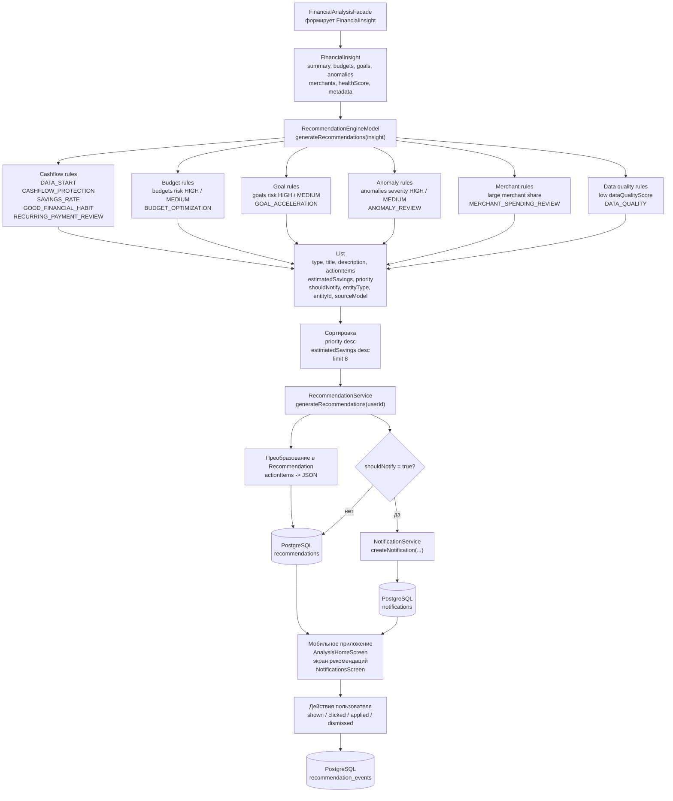

### 16.9. Компактная Mermaid-схема для рисунка 19

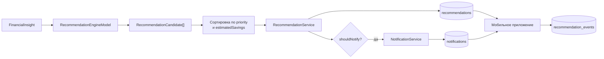

### 16.10. PlantUML-вариант схемы формирования рекомендаций

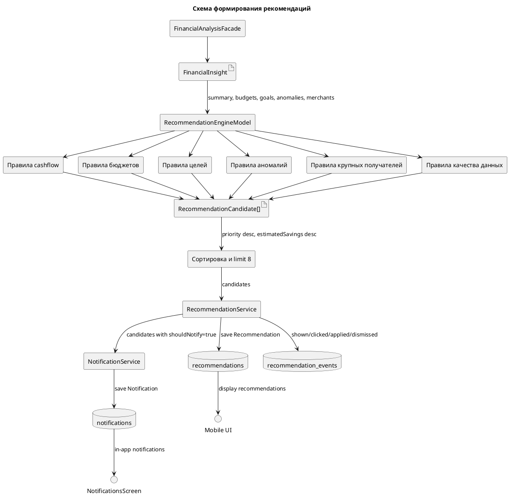

### 16.11. Последовательность формирования рекомендаций

Алгоритм можно описать под рисунком 19 следующим образом:

1. `FinancialAnalysisFacade` формирует объект `FinancialInsight` за выбранный период.
2. `RecommendationEngineModel` получает `FinancialInsight` и анализирует его составные части.
3. По `summary` формируются рекомендации, связанные с cashflow, нормой накоплений, регулярными расходами и качеством данных.
4. По `budgets` формируются рекомендации для бюджетов с риском `HIGH` или `MEDIUM`.
5. По `goals` формируются рекомендации для активных целей с риском `HIGH` или `MEDIUM`.
6. По `anomalies` формируются рекомендации проверить крупные или нетипичные операции.
7. По `merchants` формируются рекомендации, если отдельный получатель занимает значительную долю расходов.
8. Все рекомендации собираются в список `RecommendationCandidate`.
9. Список сортируется по приоритету и потенциальной экономии.
10. Итоговый набор кандидатов передаётся в `RecommendationService`.
11. `RecommendationService` сохраняет рекомендации в таблицу `recommendations`.
12. Для рекомендаций с `shouldNotify = true` создаются уведомления через `NotificationService`.
13. При показе, клике, применении или отклонении рекомендации фиксируются события в `recommendation_events`.
14. Сохранённые рекомендации отображаются пользователю в мобильном приложении.

### 16.12. Подписи стрелок для рисунка 19

| Откуда | Куда | Подпись стрелки |
| --- | --- | --- |
| `FinancialAnalysisFacade` | `FinancialInsight` | Сводный результат аналитики и контроля |
| `FinancialInsight` | `RecommendationEngineModel` | `summary`, `budgets`, `goals`, `anomalies`, `merchants` |
| `RecommendationEngineModel` | Правила рекомендаций | Анализ финансовых показателей |
| Правила рекомендаций | `RecommendationCandidate` | Сформированные кандидаты рекомендаций |
| `RecommendationCandidate` | Сортировка | `priority desc`, `estimatedSavings desc`, `limit 8` |
| Сортировка | `RecommendationService` | Итоговый список кандидатов |
| `RecommendationService` | `recommendations` | Сохранение рекомендаций |
| `RecommendationService` | `NotificationService` | Важные рекомендации с `shouldNotify = true` |
| `NotificationService` | `notifications` | Создание внутрисистемного уведомления |
| Мобильное приложение | `recommendation_events` | `shown`, `clicked`, `applied`, `dismissed` |

### 16.13. Готовый пояснительный текст под рисунок 19

На рисунке 19 представлена схема формирования рекомендаций в модуле анализа и контроля финансов. Источником данных для рекомендательного механизма является объект `FinancialInsight`, сформированный фасадом `FinancialAnalysisFacade`. Он содержит финансовую сводку, результаты контроля бюджетов, анализ финансовых целей, выявленные аномалии, сведения о крупных получателях платежей, оценку финансового состояния и метаданные расчёта.

Центральным компонентом формирования рекомендаций является `RecommendationEngineModel`. Он анализирует готовые финансовые инсайты и формирует объекты `RecommendationCandidate`. Рекомендации могут быть связаны с отрицательным cashflow, низкой нормой накоплений, регулярными расходами, риском перерасхода бюджета, риском невыполнения цели, крупными или нетипичными операциями, высокой долей расходов у отдельного получателя и недостаточным качеством данных. Рекомендательная логика рассматривается как результат анализа финансовых показателей и правил контроля, а не как отдельная ML-модель.

Сформированные кандидаты сортируются по приоритету и потенциальной экономии, после чего передаются в `RecommendationService`. Сервис сохраняет рекомендации в таблице `recommendations`, фиксирует действия пользователя в `recommendation_events` и при необходимости создаёт уведомления для наиболее важных рекомендаций. В мобильном приложении рекомендации используются для отображения пользователю практических действий, направленных на снижение расходов, поддержание финансовых целей и повышение качества аналитики.

### 16.14. Краткая версия для вставки в раздел 3.5

Рекомендации формируются компонентом `RecommendationEngineModel` на основе объекта `FinancialInsight`. Модель анализирует финансовую сводку, бюджеты, цели, аномалии, крупных получателей платежей и качество данных, после чего создаёт список `RecommendationCandidate`. Каждая рекомендация содержит тип, заголовок, описание, практические действия, оценку потенциальной экономии, приоритет, связанную сущность и признак необходимости уведомления.

После сортировки по приоритету и потенциальной экономии рекомендации передаются в `RecommendationService`, сохраняются в таблице `recommendations` и отображаются пользователю. Действия пользователя с рекомендациями фиксируются в `recommendation_events`, а наиболее важные рекомендации могут дополнительно создавать уведомления через `NotificationService`.

## 17. Схема формирования уведомлений

Этот раздел можно использовать для подготовки «Рисунок 20 — Схема формирования уведомлений». Рисунок должен показать, как финансовые события и важные рекомендации преобразуются во внутрисистемные уведомления, сохраняемые в таблице `notifications` и отображаемые на `NotificationsScreen`.

### 17.1. Назначение рисунка 20

Схема формирования уведомлений должна показать, что уведомления являются прикладным способом донести до пользователя важные результаты финансового контроля. Они не заменяют сами аналитические модели, а используют их результаты и дополнительные проверки для создания коротких сообщений внутри приложения.

Важно отметить ограничение реализации: уведомления рассматриваются как сообщения внутри приложения. Схема не должна утверждать наличие полноценной внешней push-доставки, если она не реализована отдельно.

### 17.2. Компоненты, которые нужно показать на схеме

Для рисунка 20 рекомендуется использовать следующие блоки:

1. Источники финансовых событий:
   - бюджеты;
   - цели;
   - транзакции и категории;
   - подписки;
   - важные рекомендации.
2. `FinancialNotificationService` — определяет, нужно ли создавать уведомление по финансовому событию.
3. Группы генераторов уведомлений:
   - `generateBudgetNotifications()`;
   - `generateGoalNotifications()`;
   - `generateOperationNotifications()`;
   - `generateSubscriptionNotifications()`;
   - уведомления от `RecommendationService` для важных рекомендаций.
4. `NotificationService` — создаёт и сохраняет уведомления.
5. PostgreSQL-таблица `notifications`.
6. `NotificationController` и клиентский API.
7. `NotificationsScreen` — отображение уведомлений пользователю.

### 17.3. Источники событий для уведомлений

На схеме можно показать несколько входных потоков.

| Источник | Примеры событий |
| --- | --- |
| Бюджеты | Достижение 70%, 85%, 95% или 100% лимита; прогноз перерасхода; безопасный дневной лимит; завершение периода бюджета |
| Цели | Цель почти достигнута; цель выполнена; требуется регулярный взнос; отставание от графика; риск дедлайна |
| Операции | Крупная или нетипичная транзакция; всплеск расходов по категории; новое регулярное списание |
| Подписки | Скорое продление, неиспользуемая подписка, дублирующая подписка, рост стоимости |
| Рекомендации | Важная рекомендация с `shouldNotify = true` |

### 17.4. Логика FinancialNotificationService

`FinancialNotificationService` выполняет роль фильтра и интерпретатора финансовых событий. Он не просто сохраняет любое событие как уведомление, а проверяет условия значимости.

Основные направления проверки:

- бюджетные пороги и риск перерасхода;
- цели, приближающиеся к дедлайну или отстающие от ожидаемого прогресса;
- крупные и нетипичные операции;
- всплески расходов по категориям;
- события подписок;
- важные рекомендации, которые требуют внимания пользователя.

Если условие выполнено, сервис формирует параметры уведомления:

- `type` — тип уведомления;
- `title` — заголовок;
- `message` — текст сообщения;
- `sourceModule` — модуль-источник, для данного сервиса обычно `JAVA`;
- `entityType` — тип связанной сущности, например `budget`, `goal`, `transaction`, `category`, `subscription`, `recommendation`;
- `entityId` — идентификатор связанной сущности;
- `data` — дополнительные данные в JSON.

### 17.5. Роль NotificationService

`NotificationService` отвечает за техническое создание уведомления. Он получает готовые параметры, создаёт сущность `Notification`, сериализует дополнительные данные в JSON и сохраняет запись в таблице `notifications`.

На схеме `NotificationService` лучше показать отдельным блоком после `FinancialNotificationService`, чтобы подчеркнуть разделение ответственности:

- `FinancialNotificationService` решает, нужно ли уведомление и каким оно должно быть;
- `NotificationService` сохраняет уведомление и предоставляет операции получения, чтения и очистки уведомлений.

### 17.6. Структура Notification

Итоговая запись уведомления содержит:

| Поле | Назначение |
| --- | --- |
| `id` | Идентификатор уведомления |
| `userId` | Пользователь, которому адресовано уведомление |
| `type` | Тип уведомления: бюджет, цель, операция, подписка, рекомендация и т.д. |
| `title` | Заголовок уведомления |
| `message` | Основной текст уведомления |
| `sourceModule` | Источник уведомления: `JAVA`, `GO`, `ML` или `SYSTEM` |
| `entityType` | Тип связанной сущности |
| `entityId` | Идентификатор связанной сущности |
| `data` | Дополнительные структурированные данные в JSON |
| `isRead` | Признак прочтения |
| `isArchived` | Признак архивации |
| `scheduledFor` | Плановая дата показа, если используется отложенное уведомление |
| `createdAt` | Дата создания уведомления |

### 17.7. Mermaid-схема формирования уведомлений

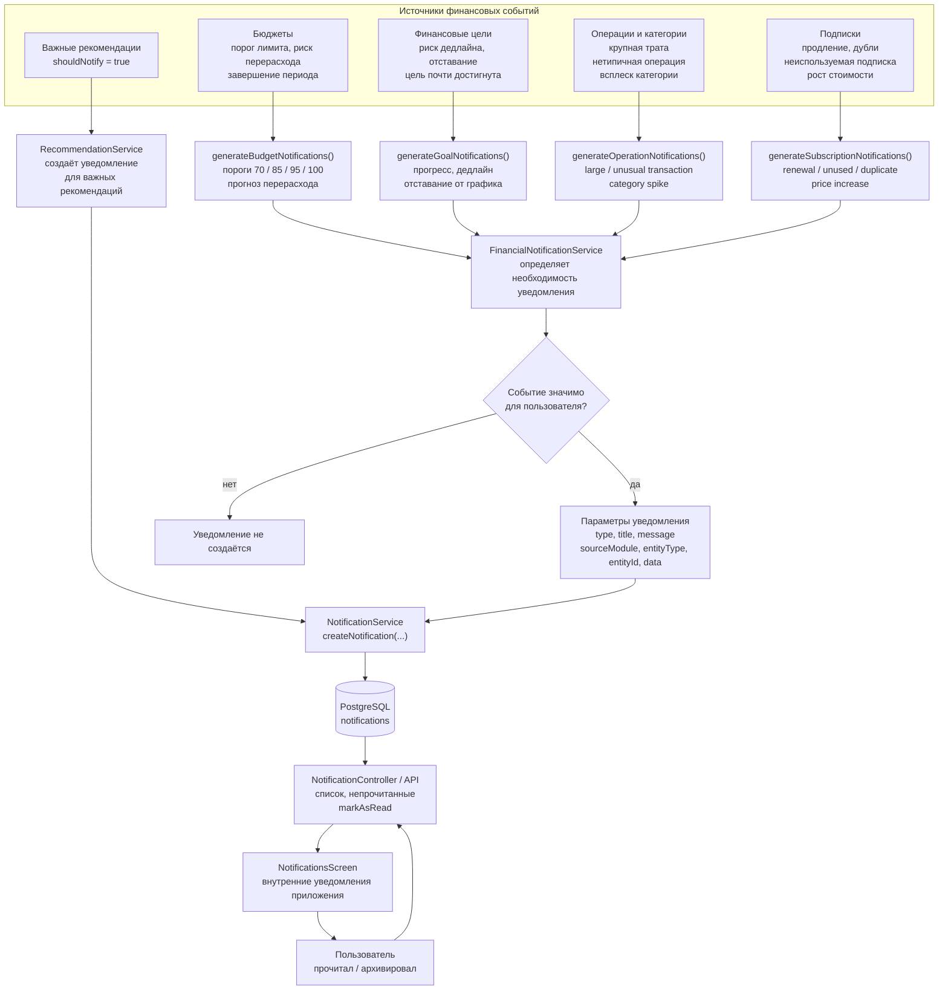

### 17.8. Компактная Mermaid-схема для рисунка 20

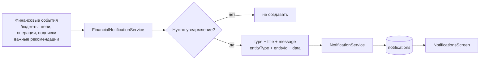

### 17.9. PlantUML-вариант схемы формирования уведомлений

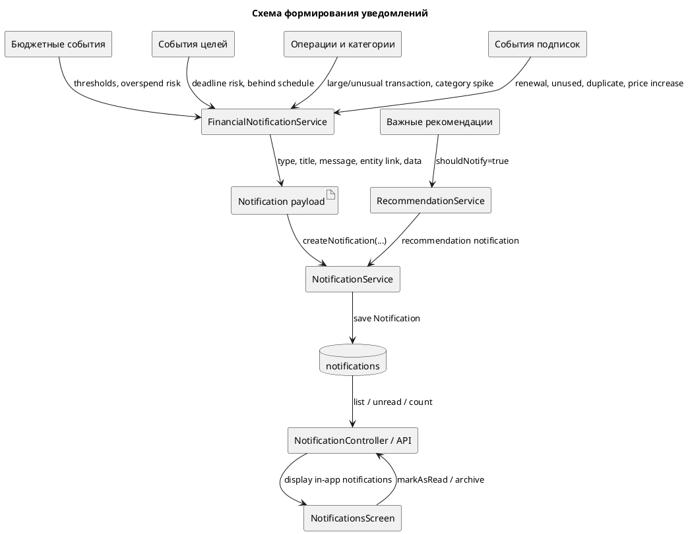

### 17.10. Последовательность формирования уведомлений

Алгоритм можно описать под рисунком 20 следующим образом:

1. В системе появляется финансовое событие: бюджет приближается к лимиту, цель отстаёт от графика, обнаружена крупная операция, выявлен всплеск категории, наступает событие по подписке или создана важная рекомендация.
2. `FinancialNotificationService` запускает соответствующий блок генерации уведомлений: бюджетный, целевой, операционный или подписочный.
3. Для каждого события рассчитываются или проверяются условия значимости.
4. Если событие не требует внимания пользователя, уведомление не создаётся.
5. Если событие значимо, формируются `type`, `title`, `message`, `entityType`, `entityId` и дополнительные данные `data`.
6. Подготовленные параметры передаются в `NotificationService.createNotification()`.
7. `NotificationService` создаёт сущность `Notification`, сериализует `data` в JSON и сохраняет запись в таблицу `notifications`.
8. Мобильное приложение получает список уведомлений через API.
9. `NotificationsScreen` отображает уведомления пользователю как сообщения внутри приложения.
10. При прочтении или архивировании уведомления обновляется его состояние.

### 17.11. Подписи стрелок для рисунка 20

| Откуда | Куда | Подпись стрелки |
| --- | --- | --- |
| Бюджеты | `FinancialNotificationService` | Порог лимита, прогноз перерасхода, завершение периода |
| Цели | `FinancialNotificationService` | Риск дедлайна, отставание от графика, достижение цели |
| Операции | `FinancialNotificationService` | Крупная или нетипичная трата, всплеск категории |
| Подписки | `FinancialNotificationService` | Продление, дубли, неиспользуемые подписки, рост стоимости |
| `RecommendationService` | `NotificationService` | Важная рекомендация с `shouldNotify = true` |
| `FinancialNotificationService` | `NotificationService` | Параметры уведомления |
| `NotificationService` | `notifications` | Сохранение уведомления |
| `notifications` | `NotificationsScreen` | Список уведомлений пользователя |
| `NotificationsScreen` | API | Отметить как прочитанное или архивировать |

### 17.12. Готовый пояснительный текст под рисунок 20

На рисунке 20 представлена схема формирования уведомлений в модуле анализа и контроля финансов. Уведомления создаются на основе финансовых событий, связанных с бюджетами, целями, операциями, категориями, подписками и важными рекомендациями. Центральным компонентом механизма является `FinancialNotificationService`, который определяет необходимость создания уведомления и формирует его смысловое содержание.

Для бюджетов уведомления могут создаваться при приближении к лимиту, риске перерасхода или завершении периода. Для целей учитываются риск невыполнения, отставание от ожидаемого прогресса, приближение дедлайна и достижение цели. Для операций и категорий учитываются крупные или нетипичные траты и всплески расходов. Отдельным источником уведомлений являются рекомендации, для которых установлен признак `shouldNotify = true`.

После определения необходимости уведомления параметры сообщения передаются в `NotificationService`. Этот сервис создаёт объект `Notification`, сохраняет его в таблицу `notifications` и предоставляет данные для отображения в мобильном приложении. В рамках данной реализации уведомления рассматриваются как внутренние сообщения приложения, отображаемые на `NotificationsScreen`; полноценная внешняя push-доставка в схеме не предполагается.

### 17.13. Краткая версия для вставки в раздел 3.5

Уведомления формируются на основе финансовых событий: приближения к лимиту бюджета, риска перерасхода, риска невыполнения цели, обнаружения крупной или нетипичной траты, событий подписок и появления важной рекомендации. `FinancialNotificationService` определяет необходимость создания уведомления и формирует его параметры, а `NotificationService` сохраняет уведомление в таблицу `notifications`.

Сохранённые уведомления отображаются на `NotificationsScreen` как внутренние сообщения приложения. В рамках данной реализации не утверждается наличие полноценной внешней push-доставки: уведомления рассматриваются как часть серверной и клиентской логики внутри приложения.

## 18. Отчётность как завершающее представление аналитики

Хотя для отчётности в данном фрагменте не требуется отдельный рисунок, её можно кратко показать рядом с рекомендациями и уведомлениями как третий способ прикладного представления результатов анализа.

`ReportService` формирует отчётные представления на основе данных `FinancialAnalysisFacade` и сохраняет их в таблицу `reports`. В рамках модуля используются следующие типы отчётов:

| Тип отчёта | Источник данных | Содержание |
| --- | --- | --- |
| `MONTHLY_SUMMARY` | Полный `FinancialInsight` | Общая финансовая сводка за период |
| `CATEGORY_ANALYSIS` | `FinancialInsight.categories` | Структура расходов по категориям |
| `GOAL_PROGRESS` | `FinancialInsight.goals` | Прогресс финансовых целей |

Краткое описание для вставки в раздел 3.5: отчётность реализована через компонент `ReportService`, который запрашивает данные у `FinancialAnalysisFacade`, формирует отчётное представление выбранного типа и сохраняет результат в таблицу `reports`. Отчёты дополняют рекомендации и уведомления, так как предоставляют пользователю не точечное предупреждение или совет, а структурированную сводку за выбранный период.

## 19. ER-фрагмент таблиц модуля анализа и контроля финансов

Этот раздел можно использовать для подготовки «Рисунок 27 — ER-фрагмент таблиц, используемых модулем анализа и контроля финансов». Важно подчеркнуть, что здесь не выполняется повторное проектирование базы данных. Логическая модель базы данных рассматривается отдельно, а данный фрагмент показывает только практическое использование таблиц модулем анализа и контроля финансов.

### 19.1. Назначение ER-фрагмента

ER-фрагмент должен показать, какие таблицы используются модулем как входные источники данных, а какие таблицы используются как хранилища результатов аналитической обработки.

На схеме рекомендуется разделить таблицы на три смысловые группы:

1. **Подготовленные входные данные**:
   - `transactions`;
   - `categories`.
2. **Данные контрольных механизмов**:
   - `budgets`;
   - `general_budgets`;
   - `goals`;
   - `goal_transactions`.
3. **Результаты аналитической обработки**:
   - `recommendations`;
   - `notifications`;
   - `reports`.

Дополнительно на схеме можно показать таблицу `users` как внешний контекст, потому что большинство таблиц содержат поле `user_id`. Однако в таблицу 3.3 её лучше не включать, если подраздел посвящён именно таблицам, используемым аналитико-контрольным модулем.

### 19.2. Таблица 3.3 — таблицы базы данных, используемые модулем

| Таблица | Назначение в модуле анализа и контроля финансов |
| --- | --- |
| `transactions` | Используется как основной источник транзакционных данных для расчёта доходов, расходов, cashflow, структуры расходов, выявления крупных и нетипичных трат. |
| `categories` | Используется для группировки доходов и расходов по категориям, построения структуры расходов и отображения аналитики по направлениям затрат. |
| `budgets` | Используется для контроля категорийных бюджетов: расчёта лимита, потраченной суммы, остатка, процента использования и уровня риска перерасхода. |
| `general_budgets` | Используется для учёта общего лимита расходов за период. В рамках модуля применяется как источник данных для общей бюджетной аналитики без расширенного описания неподтверждённых UI-сценариев. |
| `goals` | Используется для анализа финансовых целей: расчёта прогресса, остатка до целевой суммы, срока достижения и риска невыполнения цели. |
| `goal_transactions` | Используется для учёта операций, связанных с пополнением финансовых целей, и уточнения фактического прогресса накопления. |
| `notifications` | Используется для хранения уведомлений, сформированных по результатам анализа бюджетов, целей, крупных или нетипичных трат и рекомендаций. |
| `recommendations` | Используется для хранения рекомендаций, сформированных на основе финансовых инсайтов, включая данные о бюджетах, целях, cashflow, аномалиях и качестве исходных данных. |
| `reports` | Используется для хранения отчётных данных за выбранный период, включая сводные показатели, анализ категорий и прогресс финансовых целей. |

### 19.3. Ключевые поля, которые стоит отразить на ER-схеме

Чтобы рисунок не был перегружен, на нём достаточно показать только поля, важные для модуля анализа и контроля.

| Таблица | Поля, которые рекомендуется показать |
| --- | --- |
| `transactions` | `id`, `user_id`, `amount`, `currency`, `type`, `category_id`, `ml_category_id`, `ml_confidence`, `description`, `date`, `is_verified`, `is_recurring` |
| `categories` | `id`, `user_id`, `name`, `type` |
| `budgets` | `id`, `user_id`, `category_id`, `amount_limit`, `spent_amount`, `period`, `period_start`, `period_end`, `currency`, `alert_thresholds`, `is_active` |
| `general_budgets` | `id`, `user_id`, `total_limit`, `spent_amount`, `period`, `period_start`, `period_end` |
| `goals` | `id`, `user_id`, `name`, `target_amount`, `current_amount`, `currency`, `deadline`, `goal_type`, `priority`, `status`, `auto_save_amount`, `auto_save_frequency` |
| `goal_transactions` | `id`, `goal_id`, `transaction_id`, `amount`, `date`, `is_auto_save` |
| `recommendations` | `id`, `user_id`, `type`, `title`, `description`, `action_items`, `estimated_savings`, `priority`, `is_applied`, `applied_at` |
| `notifications` | `id`, `user_id`, `type`, `title`, `message`, `source_module`, `entity_type`, `entity_id`, `data`, `is_read`, `is_archived`, `scheduled_for` |
| `reports` | `id`, `user_id`, `report_type`, `period_start`, `period_end`, `data`, `pdf_url` |

### 19.4. Основные связи между таблицами

На рисунке 27 рекомендуется показать следующие связи.

| Связь | Тип связи | Назначение связи в модуле |
| --- | --- | --- |
| `categories.id` → `transactions.category_id` | 1:N | Категория используется для группировки транзакций и расчёта структуры расходов. |
| `categories.id` → `transactions.ml_category_id` | 1:N, вспомогательная | ML-категория используется как дополнительный аналитический признак, если пользовательская категория не подтверждена. |
| `categories.id` → `budgets.category_id` | 1:N | Категорийный бюджет задаёт лимит расходов по конкретной категории. |
| `goals.id` → `goal_transactions.goal_id` | 1:N | Одна финансовая цель может иметь несколько операций пополнения. |
| `transactions.id` → `goal_transactions.transaction_id` | 1:0..N, опциональная | Пополнение цели может быть связано с конкретной транзакцией. |
| `recommendations.id` → `notifications.entity_id` | логическая полиморфная | Важная рекомендация может стать источником уведомления, если `entity_type = 'recommendation'`. |
| `budgets.id` → `notifications.entity_id` | логическая полиморфная | Уведомление может быть связано с бюджетом, если `entity_type = 'budget'`. |
| `goals.id` → `notifications.entity_id` | логическая полиморфная | Уведомление может быть связано с целью, если `entity_type = 'goal'`. |
| `transactions.id` → `notifications.entity_id` | логическая полиморфная | Уведомление может быть связано с крупной или нетипичной транзакцией, если `entity_type = 'transaction'`. |

Поле `notifications.entity_id` является универсальной ссылкой на сущность-источник уведомления. Поэтому на ER-схеме такие связи лучше обозначать пунктирными линиями или отдельной подписью «логическая связь через `entity_type` + `entity_id`», чтобы не создавать впечатление строгого внешнего ключа ко всем таблицам одновременно.

### 19.5. Mermaid ER-схема для рисунка 27

Ниже приведён вариант ER-фрагмента для Mermaid. Его можно использовать как основу для построения рисунка 27.

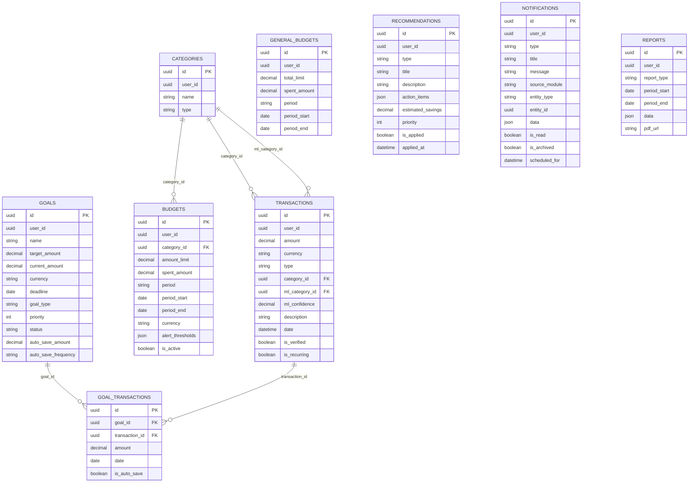

### 19.6. Mermaid-схема с группировкой по назначению

Если требуется не строго ER-представление, а более наглядная схема для дипломного рисунка, можно использовать вариант с группировкой таблиц по роли в модуле.

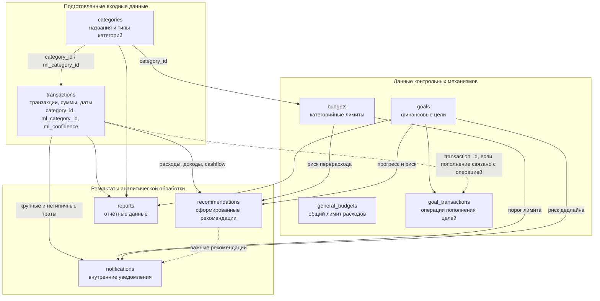

### 19.7. PlantUML-вариант ER-фрагмента

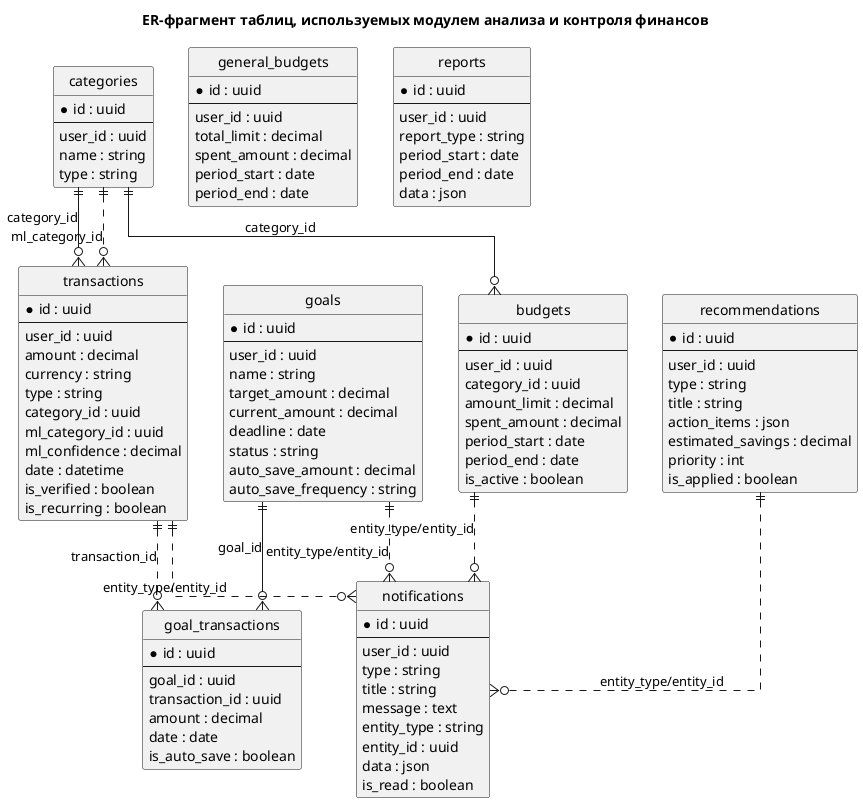

### 19.8. Как расположить таблицы на рисунке 27

Для читаемости рисунка рекомендуется использовать следующую компоновку:

- Слева разместить `transactions` и `categories`, потому что они являются основой транзакционной аналитики.
- В центре разместить `budgets`, `general_budgets`, `goals` и `goal_transactions`, потому что они используются для контрольных расчётов.
- Справа разместить `recommendations`, `notifications` и `reports`, потому что это результаты аналитической обработки.
- Связи `categories → transactions` и `categories → budgets` сделать сплошными.
- Связь `categories → transactions` по `ml_category_id` можно сделать пунктирной и подписать как «ML-признак после предварительной обработки».
- Связь `goals → goal_transactions` сделать сплошной.
- Связь `transactions → goal_transactions` сделать пунктирной, так как операция пополнения цели может быть связана с транзакцией, но такая связь не является основным источником транзакционной аналитики.
- Связи от `notifications` к бюджетам, целям, транзакциям и рекомендациям лучше показать пунктиром как логические связи через `entity_type` и `entity_id`.
- Таблицу `reports` можно расположить отдельно справа снизу, так как она хранит агрегированные отчётные данные за период и не является источником для основных расчётов.

### 19.9. Подписи связей для рисунка 27

| Откуда | Куда | Подпись на схеме |
| --- | --- | --- |
| `categories` | `transactions` | Категория подтверждённой транзакции: `category_id` |
| `categories` | `transactions` | ML-категория как аналитический признак: `ml_category_id` |
| `categories` | `budgets` | Лимит по категории: `category_id` |
| `goals` | `goal_transactions` | Пополнения цели: `goal_id` |
| `transactions` | `goal_transactions` | Связанная операция пополнения: `transaction_id` |
| `budgets` | `notifications` | Уведомление о лимите или риске перерасхода |
| `goals` | `notifications` | Уведомление о прогрессе или риске дедлайна |
| `transactions` | `notifications` | Уведомление о крупной или нетипичной трате |
| `recommendations` | `notifications` | Уведомление по важной рекомендации |
| `transactions`, `categories`, `goals` | `reports` | Данные для отчётов `MONTHLY_SUMMARY`, `CATEGORY_ANALYSIS`, `GOAL_PROGRESS` |

### 19.10. Готовый пояснительный текст под рисунок 27

На рисунке 27 представлен ER-фрагмент таблиц, используемых модулем анализа и контроля финансов. Данный фрагмент не является повторным проектированием базы данных FinApp, а отражает практическое использование уже существующих таблиц в рамках аналитико-контрольного модуля. Таблицы `transactions` и `categories` используются как подготовленные входные данные для расчёта доходов, расходов, cashflow, структуры расходов и выявления крупных или нетипичных трат.

Таблицы `budgets` и `general_budgets` применяются для контроля бюджетных ограничений. `budgets` связывается с `categories` через `category_id` и используется для расчёта лимита, потраченной суммы, остатка, процента использования и риска перерасхода по категории. `general_budgets` отражает общий лимит расходов за период и может применяться как источник общей бюджетной аналитики. Таблицы `goals` и `goal_transactions` используются для анализа финансовых целей: расчёта прогресса, остатка до целевой суммы, срока достижения, требуемого взноса и риска невыполнения цели.

Таблицы `recommendations`, `notifications` и `reports` используются для хранения результатов аналитической обработки. В `recommendations` сохраняются рекомендации, сформированные на основе объекта `FinancialInsight`; в `notifications` сохраняются внутренние уведомления приложения, связанные с бюджетами, целями, транзакциями или рекомендациями; в `reports` сохраняются отчётные представления за выбранный период. Поля `ml_category_id` и `ml_confidence` в таблице `transactions` используются только как дополнительные признаки аналитической обработки и не означают выполнение первичной ML-категоризации внутри данного модуля.

Таким образом, база данных в модуле анализа и контроля финансов выступает централизованным хранилищем FinApp, которое предоставляет входные данные для аналитических расчётов и обеспечивает сохранение результатов: рекомендаций, уведомлений и отчётных данных.

### 19.11. Краткая версия для вставки рядом с рисунком 27

ER-фрагмент на рисунке 27 показывает таблицы, которые используются модулем анализа и контроля финансов как источники данных и как хранилища результатов аналитической обработки. `transactions` и `categories` применяются для транзакционной аналитики и анализа расходов по категориям. `budgets`, `general_budgets`, `goals` и `goal_transactions` используются для контрольных расчётов по бюджетам и финансовым целям. `recommendations`, `notifications` и `reports` предназначены для хранения результатов работы модуля: рекомендаций, уведомлений и отчётных данных.

База данных в данном модуле не рассматривается как самостоятельно проектируемый компонент. Она используется как общее хранилище FinApp, обеспечивающее получение подготовленных входных данных и сохранение результатов аналитической обработки.
