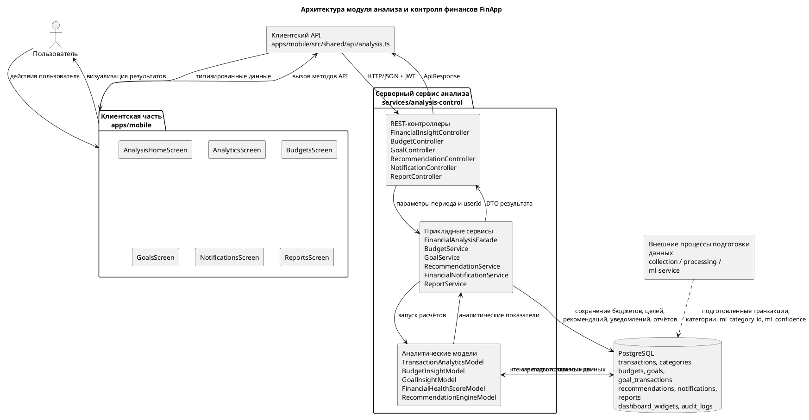
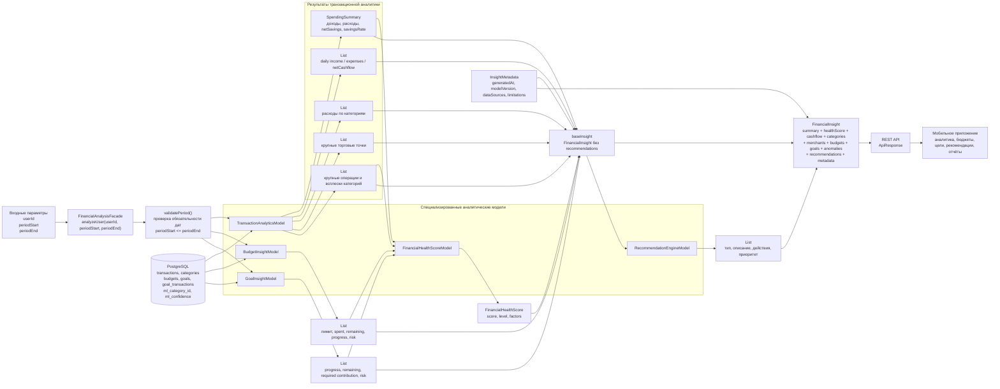
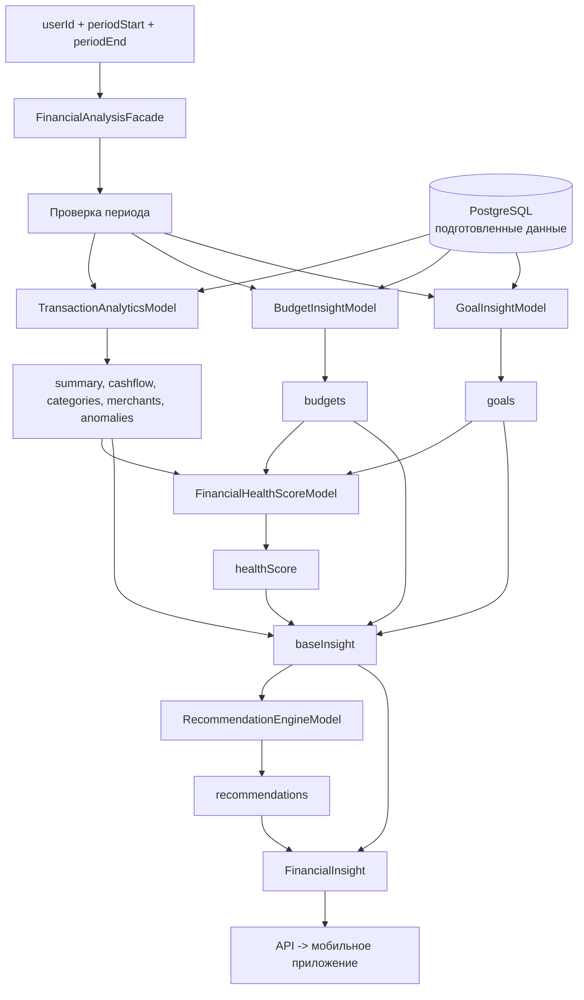
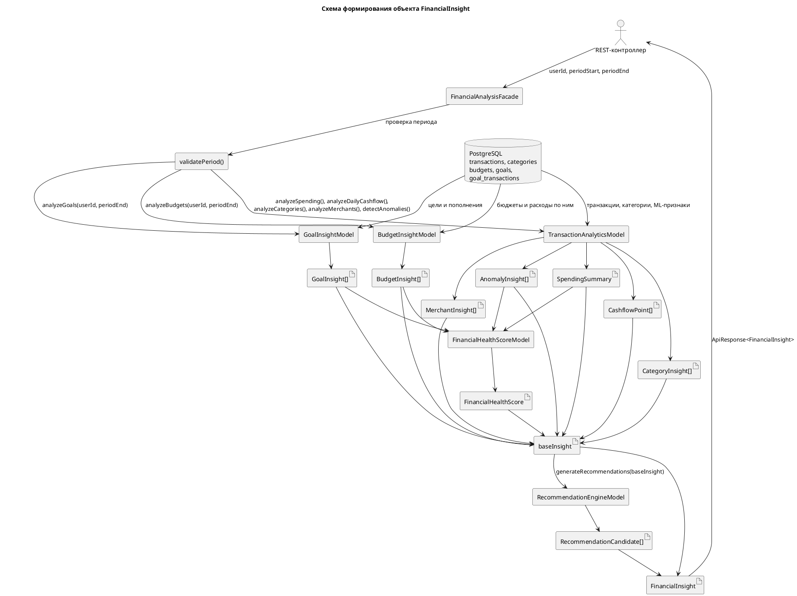
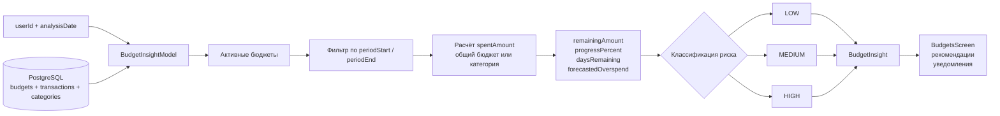
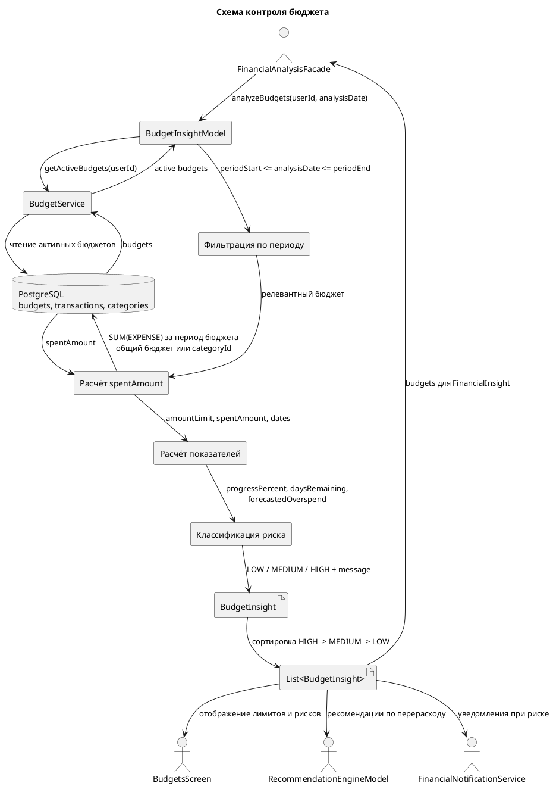

# Архитектура модуля анализа и контроля финансов FinApp

Документ предназначен для подготовки схемы «Рисунок 15 — Архитектура модуля анализа и контроля финансов FinApp» и пояснительного текста к ней. Он описывает границы модуля, состав блоков, связи между ними, направление потоков данных и подписи, которые можно перенести в графическую схему.

## 1. Назначение схемы

Схема должна показывать не всю систему FinApp, а именно уровень прикладной аналитики, реализованный модулем анализа и контроля финансов. Модуль не выполняет первичную загрузку выписок и не обучает ML-модели: он использует уже подготовленные транзакции, категории, бюджеты, цели и результаты предварительной обработки, после чего рассчитывает финансовые показатели и возвращает пользователю контрольные выводы.

Главная идея рисунка: данные проходят путь от экранов мобильного приложения к клиентскому API, затем к серверному сервису `services/analysis-control`, далее к PostgreSQL, после чего агрегированные результаты возвращаются обратно в интерфейс пользователя.

## 2. Границы модуля

### Входит в модуль

- Отображение аналитики, бюджетов, целей, уведомлений, рекомендаций и отчётов в мобильном приложении.
- Клиентский API для вызова серверных эндпоинтов анализа и контроля.
- Серверная бизнес-логика сервиса `analysis-control`.
- Расчёт финансовой сводки, cashflow, категорий расходов, торговых точек, бюджетных рисков, прогресса целей, аномалий, рекомендаций, уведомлений и отчётов.
- Чтение подготовленных данных из PostgreSQL.
- Использование `ml_category_id` и `ml_confidence` как дополнительных аналитических признаков.

### Не входит в модуль

- Первичная ML-категоризация транзакций.
- Распознавание речи и извлечение сущностей из голосового ввода.
- Импорт CSV/Excel и первичная нормализация банковских выписок.
- Обучение ML-моделей.

Эти процессы относятся к предшествующим сервисам сбора, обработки и ML. На схеме их можно показать только как внешний источник подготовленных данных, если требуется расширенный контекст.

## 3. Основные блоки для рисунка 15

На схеме удобно разместить четыре горизонтальных уровня сверху вниз.

### Уровень 1. Пользовательский интерфейс мобильного приложения

Блок: `apps/mobile`.

Внутри блока следует указать экраны:

- `AnalysisHomeScreen` — стартовый экран раздела анализа, агрегирует ключевые показатели и быстрые переходы.
- `AnalyticsScreen` — детальная аналитика по расходам, доходам, cashflow, категориям и торговым точкам.
- `BudgetsScreen` — отображение бюджетов, лимитов, текущего расхода, остатка и риска перерасхода.
- `GoalsScreen` — отображение финансовых целей, прогресса накопления, сроков и требуемых взносов.
- `NotificationsScreen` — уведомления о рисках, отклонениях, рекомендациях и событиях контроля.
- `ReportsScreen` — доступ к отчётам за выбранные периоды.

Назначение уровня: пользователь инициирует запросы и получает визуализированные результаты анализа.

### Уровень 2. Клиентский API

Блок: `apps/mobile/src/shared/api/analysis.ts`.

Внутри блока можно перечислить основные группы методов:

- `getFinancialInsights()` — получение комплексного аналитического результата за период.
- `listRecommendations()`, `generateRecommendations()`, `applyRecommendation()`, `recordRecommendationEvent()` — работа с рекомендациями и событиями их просмотра/применения.
- `listBudgets()`, `createBudget()`, `updateBudget()`, `deleteBudget()` — управление бюджетами.
- Методы работы с целями, уведомлениями и отчётами — передача запросов в соответствующие REST-эндпоинты сервиса анализа.

Назначение уровня: преобразовать действия пользователя в HTTP-запросы, добавить параметры периода или тела запросов и вернуть типизированные данные обратно в экраны.

### Уровень 3. Серверный сервис анализа и контроля

Блок: `services/analysis-control`.

Рекомендуется разбить серверный блок на три внутренних подуровня.

#### 3.1. REST-контроллеры

- `FinancialInsightController` — эндпоинт получения финансовых инсайтов за период.
- `BudgetController`, `GeneralBudgetController` — операции с бюджетами.
- `GoalController`, `GoalTransactionController` — операции с целями и пополнениями целей.
- `RecommendationController` — получение, генерация, применение и удаление рекомендаций.
- `NotificationController`, `NotificationTemplateController` — уведомления и шаблоны уведомлений.
- `ReportController`, `DashboardWidgetController` — отчёты и виджеты дашборда.

Назначение подуровня: принять запрос от клиента, определить пользователя по JWT, проверить права доступа, разобрать параметры периода и передать запрос в сервисы бизнес-логики.

#### 3.2. Прикладные сервисы

- `FinancialAnalysisFacade` — центральная точка сборки комплексного аналитического ответа.
- `BudgetService`, `GeneralBudgetService` — доменная логика бюджетов.
- `GoalService`, `GoalTransactionService` — доменная логика финансовых целей.
- `RecommendationService` — сохранённые рекомендации и события взаимодействия с ними.
- `FinancialNotificationService`, `NotificationService` — формирование и выдача уведомлений.
- `ReportService`, `DashboardWidgetService` — отчёты и дашборд-виджеты.
- `AuditLogService` — журналирование значимых операций.

Назначение подуровня: применить правила контроля, собрать данные из нескольких источников, сформировать итоговые DTO и при необходимости создать рекомендации или уведомления.

#### 3.3. Аналитические модели

- `TransactionAnalyticsModel` — расчёт финансовой сводки, daily cashflow, категорий, торговых точек и аномалий.
- `BudgetInsightModel` — расчёт использования бюджетов, остатка, процента прогресса, прогноза перерасхода и уровня риска.
- `GoalInsightModel` — расчёт прогресса целей, оставшейся суммы, требуемого ежемесячного взноса и риска невыполнения.
- `FinancialHealthScoreModel` — расчёт интегрального показателя финансового состояния.
- `RecommendationEngineModel` — генерация рекомендаций на основе сводки, бюджетов, целей, аномалий и качества данных.

Назначение подуровня: выполнить вычисления и превратить сырые данные в прикладные аналитические показатели.

### Уровень 4. Хранилище данных

Блок: `PostgreSQL`.

Внутри блока следует показать группы таблиц:

- Подготовленные данные: `transactions`, `categories`.
- Контроль расходов: `budgets`, `general_budgets`.
- Финансовые цели: `goals`, `goal_transactions`.
- Аналитические результаты и взаимодействие: `recommendations`, `recommendation_events`, `notifications`, `notification_templates`, `reports`, `dashboard_widgets`, `audit_logs`.
- Вспомогательные ML-признаки в транзакциях: `ml_category_id`, `ml_confidence`.

Назначение уровня: хранить подготовленные входные данные, пользовательские правила контроля и результаты работы прикладной аналитики.

## 4. Mermaid-схема для быстрого построения рисунка

Ниже приведён вариант схемы, который можно вставить в редактор с поддержкой Mermaid и затем экспортировать в PNG/SVG.


## 5. PlantUML-вариант для дипломной схемы

Если рисунок нужно сделать в более формальном стиле, можно использовать PlantUML.



## 6. Детальный поток данных для комплексного анализа

Основной сценарий работы модуля можно описать так:

1. Пользователь открывает раздел анализа или выбирает период на экране мобильного приложения.
2. Экран вызывает метод `getFinancialInsights()` из клиентского API.
3. Клиентский API формирует HTTP-запрос `GET /api/v1/insights` и передаёт параметры `periodStart` и `periodEnd`.
4. `FinancialInsightController` принимает запрос, извлекает идентификатор пользователя из JWT и задаёт период анализа. Если период не передан, используется текущий месяц.
5. Контроллер вызывает `FinancialAnalysisFacade.analyzeUser(userId, periodStart, periodEnd)`.
6. Фасад последовательно запускает аналитические модели:
   - `TransactionAnalyticsModel.analyzeSpending()`;
   - `TransactionAnalyticsModel.analyzeDailyCashflow()`;
   - `TransactionAnalyticsModel.analyzeCategories()`;
   - `TransactionAnalyticsModel.analyzeMerchants()`;
   - `BudgetInsightModel.analyzeBudgets()`;
   - `GoalInsightModel.analyzeGoals()`;
   - `TransactionAnalyticsModel.detectAnomalies()`;
   - `FinancialHealthScoreModel.calculate()`;
   - `RecommendationEngineModel.generateRecommendations()`.
7. Модели читают данные из PostgreSQL и выполняют SQL-агрегации по транзакциям, категориям, бюджетам и целям.
8. Результаты собираются в объект `FinancialInsight`.
9. Контроллер возвращает ответ в формате `ApiResponse<FinancialInsight>`.
10. Клиентский API преобразует ответ в TypeScript-типы.
11. Экраны мобильного приложения отображают сводку, графики, бюджеты, цели, аномалии и рекомендации.

## 7. Состав итогового аналитического ответа

Комплексный ответ `FinancialInsight` можно показать на схеме как выходной поток от сервиса анализа к клиентскому API. Он включает:

- `summary` — финансовая сводка периода: доходы, расходы, чистая экономия, норма накоплений, средний дневной расход, число транзакций, регулярные расходы и качество данных.
- `healthScore` — интегральная оценка финансового состояния и факторы, повлиявшие на неё.
- `cashflow` — дневные точки движения денежных средств: доход, расход и чистый cashflow.
- `categories` — распределение расходов по категориям.
- `merchants` — крупнейшие получатели платежей или торговые точки.
- `budgets` — состояние бюджетов, остаток, процент использования, риск и прогноз перерасхода.
- `goals` — состояние финансовых целей, прогресс, оставшаяся сумма и требуемые взносы.
- `anomalies` — необычные операции или всплески расходов.
- `recommendations` — сформированные рекомендации с приоритетом, действиями и оценкой экономии.
- `metadata` — дата генерации, версия модели, источники данных и ограничения результата.

## 8. Логика аналитических моделей

### 8.1. Расчёт финансовой сводки

`TransactionAnalyticsModel` рассчитывает:

- общую сумму доходов за период;
- общую сумму расходов за период;
- чистую экономию как разницу между доходами и расходами;
- норму накоплений как отношение чистой экономии к доходам;
- средний дневной расход;
- количество транзакций;
- сумму регулярных расходов;
- показатель качества данных.

Показатель качества данных важен для объяснимости: если часть транзакций не подтверждена или имеет низкую уверенность ML-категоризации, рекомендации должны восприниматься как требующие проверки.

### 8.2. Анализ cashflow

Для cashflow транзакции агрегируются по календарным дням. Для каждого дня рассчитываются:

- сумма доходов;
- сумма расходов;
- чистый денежный поток.

На пользовательском интерфейсе эти данные можно отобразить как линейный график или столбчатую диаграмму.

### 8.3. Анализ категорий

Категориальный анализ группирует расходы по эффективной категории. Если пользовательская категория отсутствует, используется `ml_category_id`. Это позволяет учитывать результат предварительной ML-категоризации, но не переносит саму ML-категоризацию внутрь модуля анализа.

Для каждой категории рассчитываются:

- идентификатор категории;
- название категории;
- сумма расходов;
- доля от общих расходов;
- число транзакций.

### 8.4. Контроль бюджетов

`BudgetInsightModel` анализирует активные бюджеты пользователя и определяет:

- лимит бюджета;
- фактическую сумму расходов;
- остаток;
- процент использования;
- количество дней до конца периода;
- прогнозируемый расход к концу периода;
- прогнозируемый перерасход;
- уровень риска `LOW`, `MEDIUM` или `HIGH`;
- текстовое контрольное сообщение.

Логика риска может быть отражена на схеме как отдельный подпроцесс: если бюджет уже достигнут или прогнозируется перерасход, риск высокий; если использование приближается к пороговым значениям, риск средний; иначе риск низкий.

### 8.5. Контроль финансовых целей

`GoalInsightModel` рассчитывает:

- целевую сумму;
- текущую сумму;
- оставшуюся сумму;
- процент прогресса;
- количество дней до срока;
- требуемый ежемесячный взнос;
- эквивалент автосбережения;
- уровень риска невыполнения цели;
- поясняющее сообщение.

Эту часть схемы удобно связать с экраном `GoalsScreen`, потому что именно он отображает результат контроля целей.

### 8.6. Выявление отклонений

Отклонения могут быть двух типов:

- крупная транзакция, значительно превышающая средний уровень расходов;
- всплеск расходов по категории по сравнению с исторической базой.

Результат передаётся в блок рекомендаций и уведомлений, потому что серьёзные аномалии должны быть видимы пользователю.

### 8.7. Расчёт финансового здоровья

`FinancialHealthScoreModel` объединяет несколько факторов:

- положительный или отрицательный cashflow;
- норму накоплений;
- наличие бюджетов с высоким риском;
- наличие целей с высоким риском;
- наличие критичных аномалий;
- качество данных.

На выходе формируется числовой score и уровень, например `EXCELLENT`, `GOOD`, `ATTENTION` или `RISK`.

### 8.8. Генерация рекомендаций

`RecommendationEngineModel` формирует рекомендации на основании уже рассчитанного `FinancialInsight`. Рекомендация содержит:

- тип;
- заголовок;
- описание;
- список практических действий;
- оценку потенциальной экономии;
- приоритет;
- признак необходимости уведомления;
- связанную сущность, например бюджет, цель, транзакцию или категорию;
- название модели-источника.

## 9. Подписи стрелок на схеме

Для читаемости рисунка рекомендуется подписать стрелки следующим образом:

| Откуда | Куда | Подпись стрелки |
| --- | --- | --- |
| Пользователь | Экраны мобильного приложения | Действия пользователя, выбор периода, просмотр аналитики |
| Экраны | Клиентский API | Вызов методов анализа, бюджетов, целей, рекомендаций, уведомлений, отчётов |
| Клиентский API | REST-контроллеры | HTTP/JSON, JWT, параметры периода, payload операций |
| Контроллеры | Прикладные сервисы | `userId`, период анализа, параметры операции |
| Прикладные сервисы | Аналитические модели | Запуск расчётов и контроля |
| Аналитические модели | PostgreSQL | SQL-агрегации по транзакциям, категориям, бюджетам и целям |
| PostgreSQL | Аналитические модели | Подготовленные данные и справочники |
| Модели | Прикладные сервисы | Сводка, cashflow, инсайты, риски, аномалии |
| Прикладные сервисы | Контроллеры | DTO результата |
| Контроллеры | Клиентский API | `ApiResponse` с аналитическими данными |
| Клиентский API | Экраны | Типизированные данные для UI |
| Экраны | Пользователь | Графики, карточки, предупреждения, рекомендации |

## 10. Визуальные рекомендации по оформлению рисунка

Чтобы схема была понятной в дипломной работе, рекомендуется:

- Использовать четыре крупные зоны: «Клиентская часть», «Клиентский API», «Серверный сервис анализа», «База данных».
- Внутри серверного сервиса показать вложенные блоки: контроллеры, сервисы, аналитические модели.
- Стрелки основного потока сделать сплошными.
- Внешние процессы подготовки данных показать пунктирной стрелкой к PostgreSQL.
- Отдельно подписать, что `ml_category_id` и `ml_confidence` используются только как аналитические признаки.
- Возврат результата от сервера к клиенту обозначить стрелкой с подписью `FinancialInsight`, `Recommendations`, `Notifications`, `Reports`.
- Не перегружать схему всеми классами: на рисунке оставить ключевые блоки, а подробный перечень классов вынести в пояснение под рисунком.

## 11. Готовый пояснительный текст под рисунок

На рисунке 15 представлена архитектура модуля анализа и контроля финансов FinApp. Модуль построен по модульному принципу и занимает уровень прикладной аналитики: он получает подготовленные транзакционные данные, категории, бюджеты, финансовые цели и результаты предварительной обработки, после чего формирует финансовые показатели, контрольные выводы, рекомендации, уведомления и отчёты.

Клиентская часть реализована в мобильном приложении `apps/mobile` и включает экраны `AnalysisHomeScreen`, `AnalyticsScreen`, `BudgetsScreen`, `GoalsScreen`, `NotificationsScreen` и `ReportsScreen`. Эти экраны отображают пользователю финансовую сводку, динамику cashflow, состояние бюджетов и целей, выявленные отклонения, рекомендации и отчётные данные. Взаимодействие с серверной частью выполняется через клиентский API `apps/mobile/src/shared/api/analysis.ts`, который формирует HTTP-запросы к сервису анализа и возвращает в интерфейс типизированные данные.

Серверная часть модуля реализована в сервисе `services/analysis-control`. REST-контроллеры принимают запросы от мобильного клиента, извлекают идентификатор пользователя из JWT, обрабатывают параметры периода и передают управление прикладным сервисам. Центральным элементом аналитической обработки является `FinancialAnalysisFacade`, который координирует работу моделей `TransactionAnalyticsModel`, `BudgetInsightModel`, `GoalInsightModel`, `FinancialHealthScoreModel` и `RecommendationEngineModel`.

Для выполнения расчётов сервис обращается к базе данных PostgreSQL. В ней хранятся подготовленные транзакции, категории, бюджеты, цели, пополнения целей, рекомендации, уведомления, отчёты, виджеты дашборда и журналы аудита. Поля `ml_category_id` и `ml_confidence`, сохранённые на этапе предварительной обработки, используются только как дополнительные признаки при аналитической обработке. Первичная ML-категоризация выполняется вне рассматриваемого модуля и не относится к уровню прикладной аналитики.

В результате работы модуль возвращает в мобильное приложение комплексный объект финансового анализа, включающий сводку периода, cashflow, распределение расходов по категориям и торговым точкам, состояние бюджетов и целей, выявленные аномалии, оценку финансового здоровья, рекомендации и метаданные расчёта. Такая архитектура обеспечивает разделение ответственности между пользовательским интерфейсом, клиентским API, серверной бизнес-логикой и хранилищем данных, а также позволяет независимо развивать визуальное представление, API-контракты, аналитические алгоритмы и структуру хранения данных.

## 12. Краткая версия для вставки в работу

Архитектура реализованного модуля анализа и контроля финансов построена по модульному принципу и включает клиентскую часть, клиентский API, серверный сервис анализа и базу данных. Клиентская часть в `apps/mobile` отвечает за отображение результатов анализа на экранах `AnalysisHomeScreen`, `AnalyticsScreen`, `BudgetsScreen`, `GoalsScreen`, `NotificationsScreen` и `ReportsScreen`. Взаимодействие с серверной частью выполняется через клиентский API `apps/mobile/src/shared/api/analysis.ts`.

Серверный сервис `services/analysis-control` принимает запросы мобильного клиента, выполняет расчёт финансовой сводки, анализ cashflow, контроль бюджетов и целей, выявление отклонений, расчёт финансового здоровья, формирование рекомендаций, уведомлений и отчётов. Для расчётов сервис обращается к PostgreSQL, где хранятся подготовленные транзакции, категории, бюджеты, финансовые цели и результаты предварительной обработки. Сохранённые поля `ml_category_id` и `ml_confidence` используются только как дополнительные признаки при аналитической обработке; первичная ML-категоризация выполняется вне рассматриваемого модуля.

Таким образом, архитектура модуля обеспечивает разделение ответственности между пользовательским интерфейсом, клиентским API, серверной бизнес-логикой и хранилищем данных, а также демонстрирует движение данных от действий пользователя к аналитическим расчётам и обратно к визуальному представлению результатов.

## 13. Схема формирования объекта FinancialInsight

Этот раздел можно использовать для подготовки «Рисунок 16 — Схема формирования FinancialInsight». В отличие от рисунка 15, который показывает общую архитектуру модуля, рисунок 16 должен сфокусироваться на внутреннем алгоритме работы `FinancialAnalysisFacade`: какие данные фасад получает на вход, какие модели вызывает, какие промежуточные результаты формируются и как они объединяются в единый объект `FinancialInsight`.

### 13.1. Назначение рисунка 16

Схема формирования `FinancialInsight` должна показать, что фасад не выполняет все вычисления самостоятельно. Его роль — координационная. Он принимает `userId`, `periodStart` и `periodEnd`, проверяет корректность периода, вызывает специализированные аналитические модели, собирает их результаты, формирует промежуточный объект без рекомендаций, передаёт его в механизм рекомендаций и после этого возвращает финальный `FinancialInsight`.

На рисунке важно отразить две особенности:

- `FinancialHealthScoreModel` зависит не от сырых транзакций напрямую, а от уже рассчитанных результатов: `summary`, `budgets`, `goals` и `anomalies`.
- `RecommendationEngineModel` получает на вход базовый `FinancialInsight`, потому что рекомендации строятся на совокупной картине: финансовой сводке, бюджетах, целях, аномалиях, категориях и качестве данных.

### 13.2. Входные и выходные данные фасада

Вход фасада:

- `userId` — идентификатор пользователя, для которого выполняется анализ;
- `periodStart` — дата начала анализируемого периода;
- `periodEnd` — дата окончания анализируемого периода.

Внутренние источники данных:

- `transactions` — транзакции пользователя за период;
- `categories` — категории транзакций;
- `budgets` — активные бюджеты пользователя;
- `goals` и `goal_transactions` — финансовые цели и связанные с ними операции;
- `ml_category_id`, `ml_confidence` — вспомогательные признаки, сохранённые после предварительной обработки транзакций.

Выход фасада:

- `FinancialInsight` — единый объект аналитического результата, который передаётся через REST API в мобильное приложение.

### 13.3. Рекомендуемая структура рисунка 16

Для рисунка 16 удобно использовать горизонтальное расположение слева направо.

1. Слева разместить блок «Входные параметры»: `userId`, `periodStart`, `periodEnd`.
2. Далее разместить центральный блок `FinancialAnalysisFacade`.
3. Внутри или рядом с фасадом показать шаг `validatePeriod()`.
4. Справа от фасада разместить пять специализированных моделей:
   - `TransactionAnalyticsModel`;
   - `BudgetInsightModel`;
   - `GoalInsightModel`;
   - `FinancialHealthScoreModel`;
   - `RecommendationEngineModel`.
5. Ниже моделей показать PostgreSQL как источник данных для транзакций, категорий, бюджетов и целей.
6. В правой части схемы показать сборку итогового объекта `FinancialInsight`.
7. От `FinancialInsight` провести стрелку к REST API и мобильным экранам.

### 13.4. Mermaid-схема формирования FinancialInsight

Ниже приведён готовый вариант схемы для вставки в Mermaid-редактор.



### 13.5. Упрощённая Mermaid-схема для компактного рисунка

Если на странице мало места, можно использовать компактную версию. Она лучше подходит для вставки в текстовую часть документа, где не нужно показывать все поля каждого DTO.



### 13.6. PlantUML-вариант рисунка 16



### 13.7. Последовательность формирования объекта

Алгоритм работы `FinancialAnalysisFacade` можно отразить на схеме или описать под рисунком следующим образом:

1. REST-контроллер передаёт в фасад `userId`, `periodStart` и `periodEnd`.
2. Фасад вызывает `validatePeriod()` и проверяет, что обе даты указаны, а дата начала не позже даты окончания.
3. `TransactionAnalyticsModel.analyzeSpending()` формирует `SpendingSummary`.
4. `TransactionAnalyticsModel.analyzeDailyCashflow()` формирует массив `CashflowPoint`.
5. `TransactionAnalyticsModel.analyzeCategories()` формирует список `CategoryInsight`.
6. `TransactionAnalyticsModel.analyzeMerchants()` формирует список `MerchantInsight`.
7. `BudgetInsightModel.analyzeBudgets()` формирует список `BudgetInsight` по активным бюджетам пользователя.
8. `GoalInsightModel.analyzeGoals()` формирует список `GoalInsight` по финансовым целям пользователя.
9. `TransactionAnalyticsModel.detectAnomalies()` формирует список `AnomalyInsight`.
10. `FinancialHealthScoreModel.calculate()` получает `summary`, `budgets`, `goals` и `anomalies`, после чего рассчитывает `FinancialHealthScore`.
11. Фасад собирает промежуточный `baseInsight`, где список `recommendations` временно пустой.
12. `RecommendationEngineModel.generateRecommendations(baseInsight)` анализирует базовый объект и формирует список `RecommendationCandidate`.
13. Фасад создаёт итоговый `FinancialInsight`, добавляя рекомендации и метаданные.
14. Итоговый объект возвращается в контроллер и далее передаётся через API в мобильное приложение.

### 13.8. Что показать внутри итогового объекта FinancialInsight

В правой части рисунка можно изобразить `FinancialInsight` как контейнер с такими полями:

| Поле | Источник формирования | Назначение |
| --- | --- | --- |
| `periodStart`, `periodEnd` | Входные параметры фасада | Фиксируют анализируемый период |
| `summary` | `TransactionAnalyticsModel.analyzeSpending()` | Общие доходы, расходы, экономия, норма накоплений, качество данных |
| `healthScore` | `FinancialHealthScoreModel.calculate()` | Интегральная оценка финансового состояния |
| `cashflow` | `TransactionAnalyticsModel.analyzeDailyCashflow()` | Динамика доходов и расходов по дням |
| `categories` | `TransactionAnalyticsModel.analyzeCategories()` | Распределение расходов по категориям |
| `merchants` | `TransactionAnalyticsModel.analyzeMerchants()` | Крупнейшие получатели платежей |
| `budgets` | `BudgetInsightModel.analyzeBudgets()` | Использование бюджетов и риск перерасхода |
| `goals` | `GoalInsightModel.analyzeGoals()` | Прогресс финансовых целей и риск невыполнения |
| `anomalies` | `TransactionAnalyticsModel.detectAnomalies()` | Необычные операции и всплески расходов |
| `recommendations` | `RecommendationEngineModel.generateRecommendations()` | Практические рекомендации для пользователя |
| `metadata` | `FinancialAnalysisFacade.buildMetadata()` | Дата генерации, версия модели, источники данных и ограничения |

### 13.9. Подписи стрелок для рисунка 16

| Откуда | Куда | Подпись стрелки |
| --- | --- | --- |
| REST-контроллер | `FinancialAnalysisFacade` | `userId`, `periodStart`, `periodEnd` |
| `FinancialAnalysisFacade` | `validatePeriod()` | Проверка корректности периода |
| `FinancialAnalysisFacade` | `TransactionAnalyticsModel` | Запрос транзакционной аналитики |
| `TransactionAnalyticsModel` | PostgreSQL | Чтение транзакций, категорий и ML-признаков |
| `TransactionAnalyticsModel` | `FinancialAnalysisFacade` | `summary`, `cashflow`, `categories`, `merchants`, `anomalies` |
| `FinancialAnalysisFacade` | `BudgetInsightModel` | Анализ активных бюджетов на дату `periodEnd` |
| `BudgetInsightModel` | `FinancialAnalysisFacade` | `budgets` |
| `FinancialAnalysisFacade` | `GoalInsightModel` | Анализ целей на дату `periodEnd` |
| `GoalInsightModel` | `FinancialAnalysisFacade` | `goals` |
| `FinancialAnalysisFacade` | `FinancialHealthScoreModel` | `summary`, `budgets`, `goals`, `anomalies` |
| `FinancialHealthScoreModel` | `FinancialAnalysisFacade` | `healthScore` |
| `FinancialAnalysisFacade` | `RecommendationEngineModel` | `baseInsight` |
| `RecommendationEngineModel` | `FinancialAnalysisFacade` | `recommendations` |
| `FinancialAnalysisFacade` | REST API | `FinancialInsight` |
| REST API | Мобильное приложение | `ApiResponse<FinancialInsight>` |

### 13.10. Готовый пояснительный текст под рисунок 16

На рисунке 16 представлена схема формирования объекта `FinancialInsight` центральным фасадом аналитики `FinancialAnalysisFacade`. На вход фасад получает идентификатор пользователя и период анализа, после чего выполняет проверку корректности периода и последовательно координирует работу специализированных моделей. Транзакционная аналитика формирует финансовую сводку, дневной cashflow, распределение расходов по категориям и торговым точкам, а также список выявленных отклонений. Модель бюджетов рассчитывает использование лимитов и риск перерасхода, а модель целей определяет прогресс накоплений, оставшуюся сумму и риск невыполнения цели.

После получения частных аналитических результатов фасад передаёт сводку, бюджеты, цели и аномалии в `FinancialHealthScoreModel`, где рассчитывается интегральная оценка финансового состояния пользователя. Затем фасад собирает промежуточный объект `baseInsight`, содержащий все рассчитанные показатели без рекомендаций, и передаёт его в `RecommendationEngineModel`. Это позволяет формировать рекомендации не из одного показателя, а на основе полной финансовой картины за выбранный период.

Итоговым результатом работы фасада является объект `FinancialInsight`, включающий период анализа, финансовую сводку, health score, cashflow, категории, торговые точки, бюджеты, цели, аномалии, рекомендации и метаданные расчёта. Объект возвращается через REST API в мобильное приложение и используется экранами анализа, бюджетов, целей, уведомлений, рекомендаций и отчётов. Такое построение отделяет координационную логику от частных расчётов и упрощает развитие аналитического модуля: отдельные модели можно изменять независимо, сохраняя общий контракт `FinancialInsight` для клиентского приложения.

### 13.11. Краткая версия для вставки в раздел 3.3.2

Центральным компонентом серверной части является `FinancialAnalysisFacade`. Он принимает `userId`, `periodStart` и `periodEnd`, проверяет корректность периода и координирует работу специализированных аналитических моделей. `TransactionAnalyticsModel` рассчитывает финансовую сводку, daily cashflow, распределение расходов по категориям и торговым точкам, а также выявляет аномалии. `BudgetInsightModel` анализирует активные бюджеты пользователя, `GoalInsightModel` оценивает прогресс финансовых целей, `FinancialHealthScoreModel` формирует интегральную оценку финансового состояния, а `RecommendationEngineModel` подготавливает рекомендации на основе промежуточного объекта `baseInsight`.

На рисунке 16 показано, что `FinancialInsight` формируется не одним расчётом, а последовательной сборкой нескольких групп данных: `summary`, `cashflow`, `categories`, `merchants`, `budgets`, `goals`, `anomalies`, `healthScore`, `recommendations` и `metadata`. Итоговый объект передаётся через API в мобильное приложение и используется для отображения аналитики, бюджетов, целей, уведомлений, рекомендаций и отчётов.

## 14. Схема контроля бюджета

Этот раздел можно использовать для подготовки «Рисунок 17 — Схема контроля бюджета». Рисунок должен показывать, как компонент `BudgetInsightModel` получает активные бюджеты пользователя, сопоставляет лимиты с фактическими расходами за период, рассчитывает прогноз перерасхода и формирует объект `BudgetInsight` с уровнем риска `LOW`, `MEDIUM` или `HIGH`.

### 14.1. Назначение рисунка 17

Схема контроля бюджета должна отражать не общий процесс аналитики, а отдельный механизм финансового контроля. Его задача — ответить на вопросы:

- какой лимит был задан пользователем;
- сколько уже потрачено в рамках периода бюджета;
- сколько средств осталось до лимита;
- какой процент бюджета использован;
- сохранится ли текущий темп расходов до конца периода;
- есть ли риск перерасхода;
- какое сообщение нужно показать пользователю на экране бюджетов.

На схеме важно показать, что `BudgetInsightModel` работает с уже подготовленными данными. Он не импортирует транзакции, не выполняет голосовой ввод и не запускает первичную ML-категоризацию. Если у транзакции отсутствует подтверждённая пользовательская категория, при сопоставлении с категорийным бюджетом может использоваться `ml_category_id` как вспомогательный признак.

### 14.2. Компоненты, которые нужно показать на схеме

Для рисунка 17 рекомендуется использовать следующие блоки:

1. `FinancialAnalysisFacade` или сценарий запроса аналитики — источник вызова `BudgetInsightModel.analyzeBudgets(userId, analysisDate)`.
2. `BudgetService` — получение активных бюджетов пользователя.
3. `BudgetInsightModel` — центральный блок контроля бюджета.
4. PostgreSQL — источник бюджетов, категорий и транзакций.
5. Блок фильтрации бюджетов по дате анализа.
6. Блок расчёта фактических расходов.
7. Блок расчёта показателей бюджета.
8. Блок определения риска.
9. Блок формирования `BudgetInsight`.
10. Получатели результата: `BudgetsScreen`, рекомендации, уведомления и `FinancialHealthScoreModel`.

### 14.3. Входные данные BudgetInsightModel

На вход модели поступают:

- `userId` — идентификатор пользователя;
- `analysisDate` — дата, относительно которой оценивается актуальность бюджета;
- активные бюджеты пользователя из `BudgetService.getActiveBudgets(userId)`;
- параметры каждого бюджета:
  - `budgetId`;
  - `categoryId`;
  - `amountLimit`;
  - `periodStart`;
  - `periodEnd`;
  - `period`;
  - `currency`;
  - `alertThresholds`;
  - `isActive`;
- транзакции пользователя за период бюджета;
- категории транзакций;
- вспомогательный ML-признак `ml_category_id`, если подтверждённая категория `category_id` отсутствует.

### 14.4. Логика выбора транзакций для бюджета

Для каждого активного бюджета модель определяет фактические расходы `spentAmount`.

Если бюджет общий, то есть `categoryId` отсутствует, в расчёт включаются все расходные транзакции пользователя за период бюджета:

- `user_id = userId`;
- `type = EXPENSE`;
- `date >= periodStart`;
- `date < periodEnd + 1 день`.

Если бюджет задан для конкретной категории, в расчёт включаются только расходы этой категории:

- `user_id = userId`;
- `type = EXPENSE`;
- `COALESCE(category_id, ml_category_id) = budget.categoryId`;
- `date >= periodStart`;
- `date < periodEnd + 1 день`.

Такой подход позволяет учитывать как вручную подтверждённые категории, так и результат предварительной ML-обработки, но сама ML-категоризация остаётся вне данного механизма.

### 14.5. Расчётные показатели бюджета

После получения суммы расходов модель рассчитывает основные показатели:

| Показатель | Формула / источник | Назначение |
| --- | --- | --- |
| `amountLimit` | Лимит из бюджета | Максимально допустимая сумма расходов |
| `spentAmount` | `SUM(transactions.amount)` | Фактические расходы за период бюджета |
| `remainingAmount` | `max(amountLimit - spentAmount, 0)` | Остаток до лимита |
| `progressPercent` | `spentAmount / amountLimit * 100%` | Процент использования бюджета |
| `daysRemaining` | `max(periodEnd - analysisDate, 0)` | Сколько дней осталось до конца периода |
| `elapsedDays` | `max(analysisDate - periodStart + 1, 1)` | Сколько дней периода уже прошло |
| `totalDays` | `max(periodEnd - periodStart + 1, 1)` | Полная длительность бюджетного периода |
| `forecastedSpend` | `spentAmount * totalDays / elapsedDays` | Прогноз расходов к концу периода при текущем темпе |
| `forecastedOverspend` | `max(forecastedSpend - amountLimit, 0)` | Ожидаемый перерасход |
| `riskLevel` | Правила `LOW` / `MEDIUM` / `HIGH` | Интерпретация состояния бюджета |
| `message` | Текст по уровню риска | Пояснение для пользователя |

### 14.6. Правила определения уровня риска

Для схемы можно выделить отдельный блок «Классификация риска».

Уровень `HIGH` устанавливается, если:

- `progressPercent >= 100%`, то есть лимит уже достигнут или превышен;
- или `forecastedOverspend > 0`, то есть при текущем темпе расходов прогнозируется перерасход к концу периода.

Уровень `MEDIUM` устанавливается, если:

- `progressPercent >= 85%`;
- или `progressPercent >= 70%` и до конца периода осталось больше 7 дней.

Уровень `LOW` устанавливается во всех остальных случаях, когда бюджет используется в безопасном темпе.

На рисунке это удобно представить как ромбы условий:

1. «Лимит достигнут или прогнозируется перерасход?» → `HIGH`.
2. «Использовано 85% или больше?» → `MEDIUM`.
3. «Использовано 70% или больше и осталось больше 7 дней?» → `MEDIUM`.
4. Иначе → `LOW`.

### 14.7. Формирование объекта BudgetInsight

Результатом обработки одного бюджета является объект `BudgetInsight`. На схеме его можно показать как контейнер с такими полями:

| Поле `BudgetInsight` | Смысл |
| --- | --- |
| `budgetId` | Идентификатор бюджета |
| `categoryId` | Идентификатор категории или `null` для общего бюджета |
| `categoryName` | Название категории или «Общий бюджет» |
| `periodStart`, `periodEnd` | Границы периода действия бюджета |
| `amountLimit` | Установленный лимит |
| `spentAmount` | Фактически потраченная сумма |
| `remainingAmount` | Остаток до лимита |
| `progressPercent` | Процент использования лимита |
| `riskLevel` | Уровень риска `LOW`, `MEDIUM` или `HIGH` |
| `daysRemaining` | Количество дней до конца периода |
| `forecastedOverspend` | Прогнозируемый перерасход |
| `message` | Текстовая интерпретация состояния бюджета |

После формирования всех объектов список `BudgetInsight` сортируется по уровню риска: сначала бюджеты с `HIGH`, затем `MEDIUM`, затем `LOW`. Это удобно для интерфейса, потому что наиболее проблемные бюджеты отображаются выше.

### 14.8. Mermaid-схема контроля бюджета

Ниже приведён готовый вариант схемы для вставки в Mermaid-редактор.

```mermaid
flowchart TB
    start["Запрос аналитики\nFinancialAnalysisFacade"]
    call["BudgetInsightModel\nanalyzeBudgets(userId, analysisDate)"]
    service["BudgetService\ngetActiveBudgets(userId)"]
    db[("PostgreSQL\nbudgets, categories, transactions\ncategory_id, ml_category_id")]

    active["Список активных бюджетов пользователя"]
    filter{"Бюджет актуален\nдля analysisDate?\nperiodStart <= analysisDate <= periodEnd"}
    skip["Исключить бюджет\nиз текущего анализа"]

    category{"Тип бюджета"}
    general["Общий бюджет\nсуммировать все EXPENSE\nза periodStart..periodEnd"]
    categoryBudget["Категорийный бюджет\nсуммировать EXPENSE, где\nCOALESCE(category_id, ml_category_id) = categoryId"]

    spent["spentAmount\nфактические расходы"]
    calc["Расчёт показателей\nremainingAmount = max(limit - spent, 0)\nprogressPercent = spent / limit * 100\ndaysRemaining\nelapsedDays / totalDays"]
    forecast["Прогноз\nforecastedSpend = spent * totalDays / elapsedDays\nforecastedOverspend = max(forecastedSpend - limit, 0)"]

    high{"progressPercent >= 100%\nили forecastedOverspend > 0?"}
    medium1{"progressPercent >= 85%?"}
    medium2{"progressPercent >= 70%\nи daysRemaining > 7?"}

    riskHigh["riskLevel = HIGH\nлимит достигнут или прогнозируется перерасход"]
    riskMedium["riskLevel = MEDIUM\nбюджет близок к рисковой зоне"]
    riskLow["riskLevel = LOW\nбезопасный темп расходов"]

    insight["BudgetInsight\nbudgetId, categoryName, amountLimit\nspentAmount, remainingAmount\nprogressPercent, riskLevel\ndaysRemaining, forecastedOverspend, message"]
    sort["Сортировка списка\nHIGH -> MEDIUM -> LOW"]
    output["List<BudgetInsight>"]

    consumers["Использование результата\nBudgetsScreen\nFinancialHealthScoreModel\nRecommendationEngineModel\nуведомления"]

    start --> call --> service --> active
    service --> db
    db --> service
    active --> filter
    filter -- нет --> skip
    filter -- да --> category
    category -- "categoryId = null" --> general
    category -- "categoryId задан" --> categoryBudget
    db --> general
    db --> categoryBudget
    general --> spent
    categoryBudget --> spent
    spent --> calc --> forecast --> high

    high -- да --> riskHigh
    high -- нет --> medium1
    medium1 -- да --> riskMedium
    medium1 -- нет --> medium2
    medium2 -- да --> riskMedium
    medium2 -- нет --> riskLow

    riskHigh --> insight
    riskMedium --> insight
    riskLow --> insight
    insight --> sort --> output --> consumers
```

### 14.9. Компактная Mermaid-схема для рисунка 17

Если требуется более лаконичная схема, можно использовать следующий вариант.



### 14.10. PlantUML-вариант схемы контроля бюджета



### 14.11. Последовательность контроля бюджета

Алгоритм можно описать под рисунком 17 следующим образом:

1. `FinancialAnalysisFacade` вызывает `BudgetInsightModel.analyzeBudgets(userId, analysisDate)`.
2. `BudgetInsightModel` получает активные бюджеты пользователя через `BudgetService.getActiveBudgets(userId)`.
3. Для каждого бюджета выполняется проверка актуальности: `periodStart <= analysisDate <= periodEnd`.
4. Если бюджет не относится к текущей дате анализа, он исключается из расчёта.
5. Если бюджет общий, модель суммирует все расходные транзакции пользователя за период бюджета.
6. Если бюджет категорийный, модель суммирует расходные транзакции, у которых `category_id` или `ml_category_id` соответствует категории бюджета.
7. На основе лимита и фактических расходов рассчитываются `remainingAmount` и `progressPercent`.
8. На основе дат периода рассчитываются `daysRemaining`, `elapsedDays` и `totalDays`.
9. По текущему темпу расходов рассчитывается `forecastedSpend` и `forecastedOverspend`.
10. Модель определяет уровень риска: `HIGH`, `MEDIUM` или `LOW`.
11. Для бюджета формируется текстовое сообщение, объясняющее состояние лимита.
12. Модель создаёт объект `BudgetInsight`.
13. Все `BudgetInsight` сортируются по риску, чтобы наиболее проблемные бюджеты отображались первыми.
14. Список передаётся в `FinancialInsight`, на экран `BudgetsScreen`, а также используется при формировании рекомендаций, уведомлений и общей оценки финансового состояния.

### 14.12. Подписи стрелок для рисунка 17

| Откуда | Куда | Подпись стрелки |
| --- | --- | --- |
| `FinancialAnalysisFacade` | `BudgetInsightModel` | `analyzeBudgets(userId, analysisDate)` |
| `BudgetInsightModel` | `BudgetService` | Запрос активных бюджетов пользователя |
| `BudgetService` | PostgreSQL | Чтение `budgets` |
| PostgreSQL | `BudgetInsightModel` | Бюджеты, категории, расходные транзакции |
| `BudgetInsightModel` | Фильтр периода | Проверка актуальности бюджета |
| Фильтр периода | Расчёт расходов | Только бюджеты, действующие на `analysisDate` |
| Расчёт расходов | PostgreSQL | `SUM(amount)` по `EXPENSE` за период бюджета |
| Расчёт расходов | Расчёт показателей | `spentAmount` |
| Расчёт показателей | Классификация риска | `progressPercent`, `forecastedOverspend`, `daysRemaining` |
| Классификация риска | `BudgetInsight` | `LOW` / `MEDIUM` / `HIGH`, `message` |
| `BudgetInsight` | `BudgetsScreen` | Отображение лимита, остатка, прогресса и риска |
| `BudgetInsight` | `RecommendationEngineModel` | Основание для рекомендаций по снижению расходов |
| `BudgetInsight` | `FinancialNotificationService` | Основание для уведомлений о риске перерасхода |
| `BudgetInsight` | `FinancialHealthScoreModel` | Учет бюджетного риска в общей оценке состояния |

### 14.13. Готовый пояснительный текст под рисунок 17

На рисунке 17 представлена схема контроля бюджета в модуле анализа и контроля финансов. Центральным компонентом данного механизма является `BudgetInsightModel`, который получает активные бюджеты пользователя, проверяет их актуальность для даты анализа и сопоставляет установленные лимиты с фактическими расходами за период действия бюджета. Источником данных выступает PostgreSQL, где хранятся бюджеты, категории и подготовленные транзакции пользователя. Первичный ввод, импорт, голосовой ввод и первичная ML-категоризация в рамках данного механизма не выполняются.

Для общего бюджета модель суммирует все расходные транзакции пользователя за период. Для категорийного бюджета учитываются только транзакции соответствующей категории; при отсутствии подтверждённой пользовательской категории может использоваться `ml_category_id`, сохранённый на этапе предварительной обработки. После расчёта фактических расходов модель определяет остаток до лимита, процент использования бюджета, количество дней до конца периода, прогноз расходов при текущем темпе и возможный перерасход.

На основании рассчитанных показателей `BudgetInsightModel` присваивает бюджету уровень риска. Уровень `HIGH` используется, если лимит уже достигнут или при текущем темпе прогнозируется перерасход. Уровень `MEDIUM` применяется, если бюджет близок к исчерпанию или значительная часть лимита израсходована задолго до конца периода. Уровень `LOW` означает, что бюджет используется в безопасном темпе. Итогом работы модели является объект `BudgetInsight`, содержащий лимит, потраченную сумму, остаток, процент использования, прогнозируемый перерасход, уровень риска и поясняющее сообщение.

Результат контроля бюджета используется для отображения состояния лимитов на `BudgetsScreen`, входит в состав объекта `FinancialInsight`, учитывается при расчёте общей оценки финансового состояния пользователя и может служить основанием для формирования рекомендаций и уведомлений. При наличии данных общего бюджета они могут применяться как дополнительный источник для общей бюджетной аналитики.

### 14.14. Краткая версия для вставки в раздел 3.4.1

Контроль бюджетов реализован компонентом `BudgetInsightModel`. Он получает активные бюджеты пользователя, проверяет их применимость к дате анализа и сопоставляет заданные лимиты с фактическими расходами за соответствующий период. Для общего бюджета учитываются все расходные транзакции пользователя, а для категорийного бюджета — только транзакции соответствующей категории, определяемой по `category_id` или, при его отсутствии, по `ml_category_id`.

На основе лимита и расходов рассчитываются `spentAmount`, `remainingAmount`, `progressPercent`, `daysRemaining`, `forecastedOverspend` и уровень риска `LOW`, `MEDIUM` или `HIGH`. Сформированный объект `BudgetInsight` используется на экране `BudgetsScreen`, включается в `FinancialInsight`, а также применяется при генерации рекомендаций, уведомлений и общей оценки финансового состояния пользователя.
