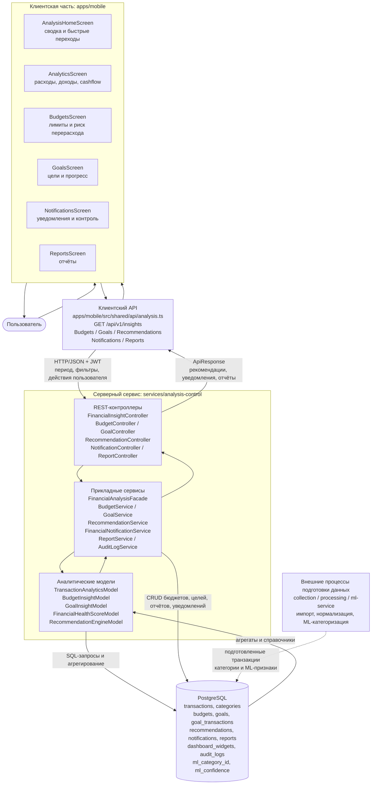
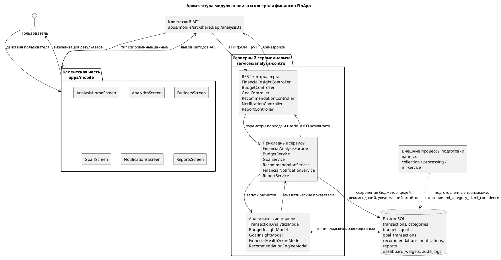

# Архитектура модуля анализа и контроля финансов FinApp

Документ предназначен для подготовки схемы «Рисунок 15 — Архитектура модуля анализа и контроля финансов FinApp» и пояснительного текста к ней. Он описывает границы модуля, состав блоков, связи между ними, направление потоков данных и подписи, которые можно перенести в графическую схему.

## 1. Назначение схемы

Схема должна показывать не всю систему FinApp, а именно уровень прикладной аналитики, реализованный модулем анализа и контроля финансов. Модуль не выполняет первичную загрузку выписок и не обучает ML-модели: он использует уже подготовленные транзакции, категории, бюджеты, цели и результаты предварительной обработки, после чего рассчитывает финансовые показатели и возвращает пользователю контрольные выводы.

Главная идея рисунка: данные проходят путь от экранов мобильного приложения к клиентскому API, затем к серверному сервису `services/analysis-control`, далее к PostgreSQL, после чего агрегированные результаты возвращаются обратно в интерфейс пользователя.

## 2. Границы модуля

### Входит в модуль

- Отображение аналитики, бюджетов, целей, уведомлений, рекомендаций и отчётов в мобильном приложении.
- Клиентский API для вызова серверных эндпоинтов анализа и контроля.
- Серверная бизнес-логика сервиса `analysis-control`.
- Расчёт финансовой сводки, cashflow, категорий расходов, торговых точек, бюджетных рисков, прогресса целей, аномалий, рекомендаций, уведомлений и отчётов.
- Чтение подготовленных данных из PostgreSQL.
- Использование `ml_category_id` и `ml_confidence` как дополнительных аналитических признаков.

### Не входит в модуль

- Первичная ML-категоризация транзакций.
- Распознавание речи и извлечение сущностей из голосового ввода.
- Импорт CSV/Excel и первичная нормализация банковских выписок.
- Обучение ML-моделей.

Эти процессы относятся к предшествующим сервисам сбора, обработки и ML. На схеме их можно показать только как внешний источник подготовленных данных, если требуется расширенный контекст.

## 3. Основные блоки для рисунка 15

На схеме удобно разместить четыре горизонтальных уровня сверху вниз.

### Уровень 1. Пользовательский интерфейс мобильного приложения

Блок: `apps/mobile`.

Внутри блока следует указать экраны:

- `AnalysisHomeScreen` — стартовый экран раздела анализа, агрегирует ключевые показатели и быстрые переходы.
- `AnalyticsScreen` — детальная аналитика по расходам, доходам, cashflow, категориям и торговым точкам.
- `BudgetsScreen` — отображение бюджетов, лимитов, текущего расхода, остатка и риска перерасхода.
- `GoalsScreen` — отображение финансовых целей, прогресса накопления, сроков и требуемых взносов.
- `NotificationsScreen` — уведомления о рисках, отклонениях, рекомендациях и событиях контроля.
- `ReportsScreen` — доступ к отчётам за выбранные периоды.

Назначение уровня: пользователь инициирует запросы и получает визуализированные результаты анализа.

### Уровень 2. Клиентский API

Блок: `apps/mobile/src/shared/api/analysis.ts`.

Внутри блока можно перечислить основные группы методов:

- `getFinancialInsights()` — получение комплексного аналитического результата за период.
- `listRecommendations()`, `generateRecommendations()`, `applyRecommendation()`, `recordRecommendationEvent()` — работа с рекомендациями и событиями их просмотра/применения.
- `listBudgets()`, `createBudget()`, `updateBudget()`, `deleteBudget()` — управление бюджетами.
- Методы работы с целями, уведомлениями и отчётами — передача запросов в соответствующие REST-эндпоинты сервиса анализа.

Назначение уровня: преобразовать действия пользователя в HTTP-запросы, добавить параметры периода или тела запросов и вернуть типизированные данные обратно в экраны.

### Уровень 3. Серверный сервис анализа и контроля

Блок: `services/analysis-control`.

Рекомендуется разбить серверный блок на три внутренних подуровня.

#### 3.1. REST-контроллеры

- `FinancialInsightController` — эндпоинт получения финансовых инсайтов за период.
- `BudgetController`, `GeneralBudgetController` — операции с бюджетами.
- `GoalController`, `GoalTransactionController` — операции с целями и пополнениями целей.
- `RecommendationController` — получение, генерация, применение и удаление рекомендаций.
- `NotificationController`, `NotificationTemplateController` — уведомления и шаблоны уведомлений.
- `ReportController`, `DashboardWidgetController` — отчёты и виджеты дашборда.

Назначение подуровня: принять запрос от клиента, определить пользователя по JWT, проверить права доступа, разобрать параметры периода и передать запрос в сервисы бизнес-логики.

#### 3.2. Прикладные сервисы

- `FinancialAnalysisFacade` — центральная точка сборки комплексного аналитического ответа.
- `BudgetService`, `GeneralBudgetService` — доменная логика бюджетов.
- `GoalService`, `GoalTransactionService` — доменная логика финансовых целей.
- `RecommendationService` — сохранённые рекомендации и события взаимодействия с ними.
- `FinancialNotificationService`, `NotificationService` — формирование и выдача уведомлений.
- `ReportService`, `DashboardWidgetService` — отчёты и дашборд-виджеты.
- `AuditLogService` — журналирование значимых операций.

Назначение подуровня: применить правила контроля, собрать данные из нескольких источников, сформировать итоговые DTO и при необходимости создать рекомендации или уведомления.

#### 3.3. Аналитические модели

- `TransactionAnalyticsModel` — расчёт финансовой сводки, daily cashflow, категорий, торговых точек и аномалий.
- `BudgetInsightModel` — расчёт использования бюджетов, остатка, процента прогресса, прогноза перерасхода и уровня риска.
- `GoalInsightModel` — расчёт прогресса целей, оставшейся суммы, требуемого ежемесячного взноса и риска невыполнения.
- `FinancialHealthScoreModel` — расчёт интегрального показателя финансового состояния.
- `RecommendationEngineModel` — генерация рекомендаций на основе сводки, бюджетов, целей, аномалий и качества данных.

Назначение подуровня: выполнить вычисления и превратить сырые данные в прикладные аналитические показатели.

### Уровень 4. Хранилище данных

Блок: `PostgreSQL`.

Внутри блока следует показать группы таблиц:

- Подготовленные данные: `transactions`, `categories`.
- Контроль расходов: `budgets`, `general_budgets`.
- Финансовые цели: `goals`, `goal_transactions`.
- Аналитические результаты и взаимодействие: `recommendations`, `recommendation_events`, `notifications`, `notification_templates`, `reports`, `dashboard_widgets`, `audit_logs`.
- Вспомогательные ML-признаки в транзакциях: `ml_category_id`, `ml_confidence`.

Назначение уровня: хранить подготовленные входные данные, пользовательские правила контроля и результаты работы прикладной аналитики.

## 4. Mermaid-схема для быстрого построения рисунка

Ниже приведён вариант схемы, который можно вставить в редактор с поддержкой Mermaid и затем экспортировать в PNG/SVG.

## 5. PlantUML-вариант для дипломной схемы

Если рисунок нужно сделать в более формальном стиле, можно использовать PlantUML.

## 6. Детальный поток данных для комплексного анализа

Основной сценарий работы модуля можно описать так:

1. Пользователь открывает раздел анализа или выбирает период на экране мобильного приложения.
2. Экран вызывает метод `getFinancialInsights()` из клиентского API.
3. Клиентский API формирует HTTP-запрос `GET /api/v1/insights` и передаёт параметры `periodStart` и `periodEnd`.
4. `FinancialInsightController` принимает запрос, извлекает идентификатор пользователя из JWT и задаёт период анализа. Если период не передан, используется текущий месяц.
5. Контроллер вызывает `FinancialAnalysisFacade.analyzeUser(userId, periodStart, periodEnd)`.
6. Фасад последовательно запускает аналитические модели:
   - `TransactionAnalyticsModel.analyzeSpending()`;
   - `TransactionAnalyticsModel.analyzeDailyCashflow()`;
   - `TransactionAnalyticsModel.analyzeCategories()`;
   - `TransactionAnalyticsModel.analyzeMerchants()`;
   - `BudgetInsightModel.analyzeBudgets()`;
   - `GoalInsightModel.analyzeGoals()`;
   - `TransactionAnalyticsModel.detectAnomalies()`;
   - `FinancialHealthScoreModel.calculate()`;
   - `RecommendationEngineModel.generateRecommendations()`.
7. Модели читают данные из PostgreSQL и выполняют SQL-агрегации по транзакциям, категориям, бюджетам и целям.
8. Результаты собираются в объект `FinancialInsight`.
9. Контроллер возвращает ответ в формате `ApiResponse<FinancialInsight>`.
10. Клиентский API преобразует ответ в TypeScript-типы.
11. Экраны мобильного приложения отображают сводку, графики, бюджеты, цели, аномалии и рекомендации.

## 7. Состав итогового аналитического ответа

Комплексный ответ `FinancialInsight` можно показать на схеме как выходной поток от сервиса анализа к клиентскому API. Он включает:

- `summary` — финансовая сводка периода: доходы, расходы, чистая экономия, норма накоплений, средний дневной расход, число транзакций, регулярные расходы и качество данных.
- `healthScore` — интегральная оценка финансового состояния и факторы, повлиявшие на неё.
- `cashflow` — дневные точки движения денежных средств: доход, расход и чистый cashflow.
- `categories` — распределение расходов по категориям.
- `merchants` — крупнейшие получатели платежей или торговые точки.
- `budgets` — состояние бюджетов, остаток, процент использования, риск и прогноз перерасхода.
- `goals` — состояние финансовых целей, прогресс, оставшаяся сумма и требуемые взносы.
- `anomalies` — необычные операции или всплески расходов.
- `recommendations` — сформированные рекомендации с приоритетом, действиями и оценкой экономии.
- `metadata` — дата генерации, версия модели, источники данных и ограничения результата.

## 8. Логика аналитических моделей

### 8.1. Расчёт финансовой сводки

`TransactionAnalyticsModel` рассчитывает:

- общую сумму доходов за период;
- общую сумму расходов за период;
- чистую экономию как разницу между доходами и расходами;
- норму накоплений как отношение чистой экономии к доходам;
- средний дневной расход;
- количество транзакций;
- сумму регулярных расходов;
- показатель качества данных.

Показатель качества данных важен для объяснимости: если часть транзакций не подтверждена или имеет низкую уверенность ML-категоризации, рекомендации должны восприниматься как требующие проверки.

### 8.2. Анализ cashflow

Для cashflow транзакции агрегируются по календарным дням. Для каждого дня рассчитываются:

- сумма доходов;
- сумма расходов;
- чистый денежный поток.

На пользовательском интерфейсе эти данные можно отобразить как линейный график или столбчатую диаграмму.

### 8.3. Анализ категорий

Категориальный анализ группирует расходы по эффективной категории. Если пользовательская категория отсутствует, используется `ml_category_id`. Это позволяет учитывать результат предварительной ML-категоризации, но не переносит саму ML-категоризацию внутрь модуля анализа.

Для каждой категории рассчитываются:

- идентификатор категории;
- название категории;
- сумма расходов;
- доля от общих расходов;
- число транзакций.

### 8.4. Контроль бюджетов

`BudgetInsightModel` анализирует активные бюджеты пользователя и определяет:

- лимит бюджета;
- фактическую сумму расходов;
- остаток;
- процент использования;
- количество дней до конца периода;
- прогнозируемый расход к концу периода;
- прогнозируемый перерасход;
- уровень риска `LOW`, `MEDIUM` или `HIGH`;
- текстовое контрольное сообщение.

Логика риска может быть отражена на схеме как отдельный подпроцесс: если бюджет уже достигнут или прогнозируется перерасход, риск высокий; если использование приближается к пороговым значениям, риск средний; иначе риск низкий.

### 8.5. Контроль финансовых целей

`GoalInsightModel` рассчитывает:

- целевую сумму;
- текущую сумму;
- оставшуюся сумму;
- процент прогресса;
- количество дней до срока;
- требуемый ежемесячный взнос;
- эквивалент автосбережения;
- уровень риска невыполнения цели;
- поясняющее сообщение.

Эту часть схемы удобно связать с экраном `GoalsScreen`, потому что именно он отображает результат контроля целей.

### 8.6. Выявление отклонений

Отклонения могут быть двух типов:

- крупная транзакция, значительно превышающая средний уровень расходов;
- всплеск расходов по категории по сравнению с исторической базой.

Результат передаётся в блок рекомендаций и уведомлений, потому что серьёзные аномалии должны быть видимы пользователю.

### 8.7. Расчёт финансового здоровья

`FinancialHealthScoreModel` объединяет несколько факторов:

- положительный или отрицательный cashflow;
- норму накоплений;
- наличие бюджетов с высоким риском;
- наличие целей с высоким риском;
- наличие критичных аномалий;
- качество данных.

На выходе формируется числовой score и уровень, например `EXCELLENT`, `GOOD`, `ATTENTION` или `RISK`.

### 8.8. Генерация рекомендаций

`RecommendationEngineModel` формирует рекомендации на основании уже рассчитанного `FinancialInsight`. Рекомендация содержит:

- тип;
- заголовок;
- описание;
- список практических действий;
- оценку потенциальной экономии;
- приоритет;
- признак необходимости уведомления;
- связанную сущность, например бюджет, цель, транзакцию или категорию;
- название модели-источника.

## 9. Подписи стрелок на схеме

Для читаемости рисунка рекомендуется подписать стрелки следующим образом:

| Откуда | Куда | Подпись стрелки |
| --- | --- | --- |
| Пользователь | Экраны мобильного приложения | Действия пользователя, выбор периода, просмотр аналитики |
| Экраны | Клиентский API | Вызов методов анализа, бюджетов, целей, рекомендаций, уведомлений, отчётов |
| Клиентский API | REST-контроллеры | HTTP/JSON, JWT, параметры периода, payload операций |
| Контроллеры | Прикладные сервисы | `userId`, период анализа, параметры операции |
| Прикладные сервисы | Аналитические модели | Запуск расчётов и контроля |
| Аналитические модели | PostgreSQL | SQL-агрегации по транзакциям, категориям, бюджетам и целям |
| PostgreSQL | Аналитические модели | Подготовленные данные и справочники |
| Модели | Прикладные сервисы | Сводка, cashflow, инсайты, риски, аномалии |
| Прикладные сервисы | Контроллеры | DTO результата |
| Контроллеры | Клиентский API | `ApiResponse` с аналитическими данными |
| Клиентский API | Экраны | Типизированные данные для UI |
| Экраны | Пользователь | Графики, карточки, предупреждения, рекомендации |

## 10. Визуальные рекомендации по оформлению рисунка

Чтобы схема была понятной в дипломной работе, рекомендуется:

- Использовать четыре крупные зоны: «Клиентская часть», «Клиентский API», «Серверный сервис анализа», «База данных».
- Внутри серверного сервиса показать вложенные блоки: контроллеры, сервисы, аналитические модели.
- Стрелки основного потока сделать сплошными.
- Внешние процессы подготовки данных показать пунктирной стрелкой к PostgreSQL.
- Отдельно подписать, что `ml_category_id` и `ml_confidence` используются только как аналитические признаки.
- Возврат результата от сервера к клиенту обозначить стрелкой с подписью `FinancialInsight`, `Recommendations`, `Notifications`, `Reports`.
- Не перегружать схему всеми классами: на рисунке оставить ключевые блоки, а подробный перечень классов вынести в пояснение под рисунком.

## 11. Готовый пояснительный текст под рисунок

На рисунке 15 представлена архитектура модуля анализа и контроля финансов FinApp. Модуль построен по модульному принципу и занимает уровень прикладной аналитики: он получает подготовленные транзакционные данные, категории, бюджеты, финансовые цели и результаты предварительной обработки, после чего формирует финансовые показатели, контрольные выводы, рекомендации, уведомления и отчёты.

Клиентская часть реализована в мобильном приложении `apps/mobile` и включает экраны `AnalysisHomeScreen`, `AnalyticsScreen`, `BudgetsScreen`, `GoalsScreen`, `NotificationsScreen` и `ReportsScreen`. Эти экраны отображают пользователю финансовую сводку, динамику cashflow, состояние бюджетов и целей, выявленные отклонения, рекомендации и отчётные данные. Взаимодействие с серверной частью выполняется через клиентский API `apps/mobile/src/shared/api/analysis.ts`, который формирует HTTP-запросы к сервису анализа и возвращает в интерфейс типизированные данные.

Серверная часть модуля реализована в сервисе `services/analysis-control`. REST-контроллеры принимают запросы от мобильного клиента, извлекают идентификатор пользователя из JWT, обрабатывают параметры периода и передают управление прикладным сервисам. Центральным элементом аналитической обработки является `FinancialAnalysisFacade`, который координирует работу моделей `TransactionAnalyticsModel`, `BudgetInsightModel`, `GoalInsightModel`, `FinancialHealthScoreModel` и `RecommendationEngineModel`.

Для выполнения расчётов сервис обращается к базе данных PostgreSQL. В ней хранятся подготовленные транзакции, категории, бюджеты, цели, пополнения целей, рекомендации, уведомления, отчёты, виджеты дашборда и журналы аудита. Поля `ml_category_id` и `ml_confidence`, сохранённые на этапе предварительной обработки, используются только как дополнительные признаки при аналитической обработке. Первичная ML-категоризация выполняется вне рассматриваемого модуля и не относится к уровню прикладной аналитики.

В результате работы модуль возвращает в мобильное приложение комплексный объект финансового анализа, включающий сводку периода, cashflow, распределение расходов по категориям и торговым точкам, состояние бюджетов и целей, выявленные аномалии, оценку финансового здоровья, рекомендации и метаданные расчёта. Такая архитектура обеспечивает разделение ответственности между пользовательским интерфейсом, клиентским API, серверной бизнес-логикой и хранилищем данных, а также позволяет независимо развивать визуальное представление, API-контракты, аналитические алгоритмы и структуру хранения данных.

## 12. Краткая версия для вставки в работу

Архитектура реализованного модуля анализа и контроля финансов построена по модульному принципу и включает клиентскую часть, клиентский API, серверный сервис анализа и базу данных. Клиентская часть в `apps/mobile` отвечает за отображение результатов анализа на экранах `AnalysisHomeScreen`, `AnalyticsScreen`, `BudgetsScreen`, `GoalsScreen`, `NotificationsScreen` и `ReportsScreen`. Взаимодействие с серверной частью выполняется через клиентский API `apps/mobile/src/shared/api/analysis.ts`.

Серверный сервис `services/analysis-control` принимает запросы мобильного клиента, выполняет расчёт финансовой сводки, анализ cashflow, контроль бюджетов и целей, выявление отклонений, расчёт финансового здоровья, формирование рекомендаций, уведомлений и отчётов. Для расчётов сервис обращается к PostgreSQL, где хранятся подготовленные транзакции, категории, бюджеты, финансовые цели и результаты предварительной обработки. Сохранённые поля `ml_category_id` и `ml_confidence` используются только как дополнительные признаки при аналитической обработке; первичная ML-категоризация выполняется вне рассматриваемого модуля.

Таким образом, архитектура модуля обеспечивает разделение ответственности между пользовательским интерфейсом, клиентским API, серверной бизнес-логикой и хранилищем данных, а также демонстрирует движение данных от действий пользователя к аналитическим расчётам и обратно к визуальному представлению результатов.
